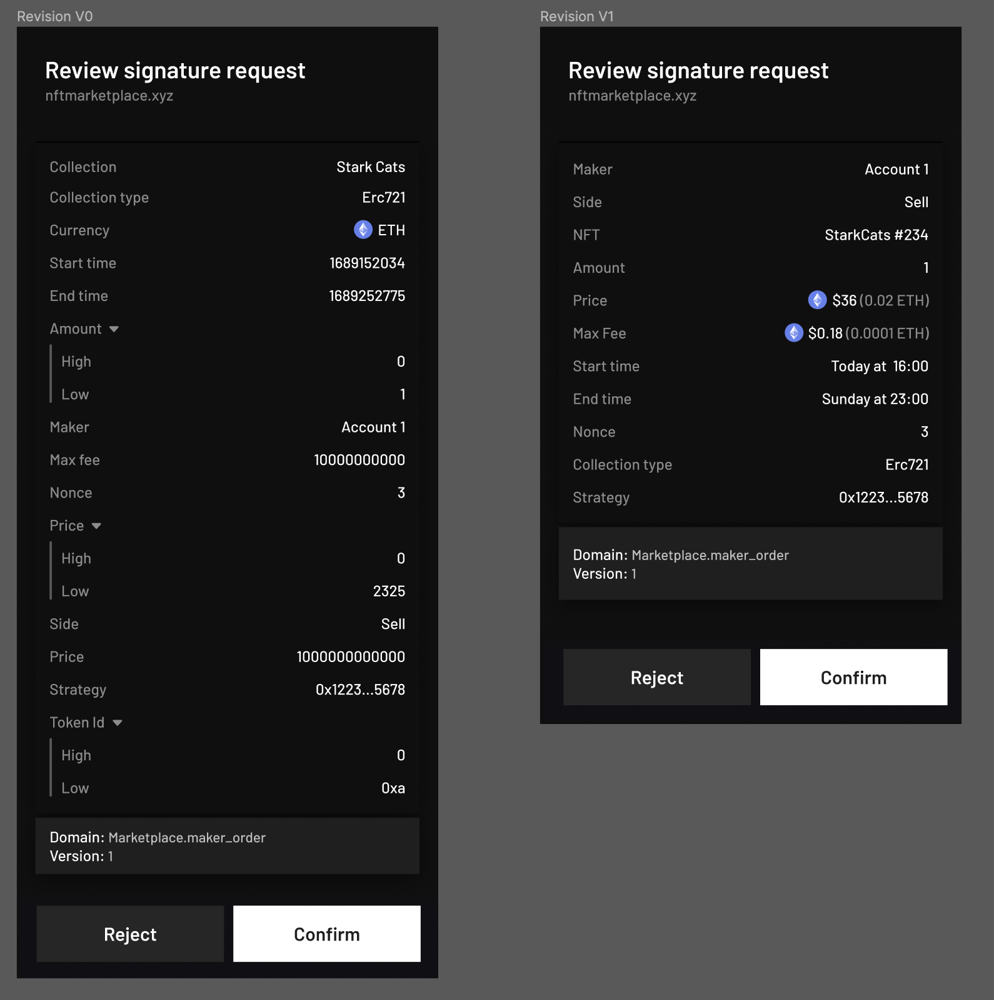

## Abstract

Just as in EIP712, this is a standard for hashing and signing typed structured data as opposed to just hexadecimal (or felt) values in Starknet. 

The purpose is NOT to define how you should design your protocol. 

## Motivation

Signing blindly some random hexadecimal is not very user-friendly, but on top of that, it is very dangerous. It is important for the user to understand what he is about to sign by showing him values he can understand. 

This document aims to create a standard that’s compatible with existing Dapps, wallets, and smart contracts while also adding some extra functionality to express the new types to help with a better display. This document consolidates some previous efforts to create off-chain signatures in Starknet (some of which were not well documented).

Here is an example of an NFT sell order, and how a wallet will be able to show today, versus what can be done after the improvements in this spec



## Specification

Inspired by EIP-712, we can define the encoding of an off-chain message as:

```jsx
signed_data = encode(PREFIX_MESSAGE, Enc[domain_separator], account, Enc[message])
```

`hash_array(array)`  
For revision `0`: It will use the `pedersen` function as hash function. See:  
https://docs.starknet.io/documentation/architecture_and_concepts/Cryptography/hash-functions/#pedersen_array_hash

For revision `1`: It will use the `poseidon` function as hash function. See:  
https://docs.starknet.io/documentation/architecture_and_concepts/Cryptography/hash-functions/#poseidon_array_hash

`starknet_keccak(str)`  
as the starknet_keccak hash on str. See:  
https://docs.starknet.io/documentation/architecture_and_concepts/Cryptography/hash-functions/#starknet_keccak

`serialise(x)`  
as the way cairo transforms the value into a felt

`escape(name)`  
For revision `0`:  Returns the same as the input.  
For revision `1`:  The double quoted name with any escaping applied. Following the spec for JSON objects. See:  
https://www.json.org/json-en.html

### Prefix message

The `PREFIX_MESSAGE` **must be** `StarkNet Message`.  
This is intended to distinguish between a message sent off-chain for future use and a transaction that will be directly sent to the sequencer for on-chain processing.

### Domain separator

The `domain_separator` is defined as the object below.

```js
"StarknetDomain": [
  { "name": "name", "type": "shortstring" }, 
  { "name": "version", "type": "shortstring" },
  { "name": "chainId", "type": "shortstring" },
  { "name": "revision", "type": "shortstring" }
]
```

This object ensures the uniqueness of messages based on:

- **name**: The name of the Dapp, can even contain the function name if your contract needs to perform multiple off-chain signatures.
- **version**: The version of the Dapp your contract is using. Prevents two versions of the same Dapp from producing the same hash. Typically, if you update your contract and the hashing behavior changes, this field should be updated.
- **chainId**: The chain ID used by the Dapp is represented as a shortstring. Prevents replay attacks from one network to another.
- **revision (optional)**: the revision of the specification to be used. If the value is omitted it will default to `0` .
    - Revision `0`: Represents the de facto spec before this SNIP was published. The purpose is to help with backwards compatibility. It’s not recommended to use it.
    - Revision `1`: Will be the initial version of the specification. Note that for this revision the value in this field should be the integer `1` and not the shortstring `"1"` despite being defined as shortstring. This exception is made to support an inconsistency in the Braavos wallet implementation. See the [example](#json-example) below.
    - Revision `2`: Draft, see [Revision 2](#revision-2-draft) below. The value in this field is the shortstring `"2"`. Implementations MUST reject any revision they do not support.

Introduced in revision `0`, changed in revision `1`  
In revision `0` the fields `name` , `version` and `chainId` are of type `felt` .  
Starting with revision `1` those fields are using the type `shortstring` .  
In revision `0` the field `chainId` was also called `chain_id`.

In revision `0` the domain object is named `StarkNetDomain`.  
Starting with revision `1` the domain object is named `StarknetDomain`.  
An issue arises when a user using an old version of the wallet that only supports revision `0` receives a request sign with revision `1`.  The outdated wallet, unaware of revision `1` , would calculate the hash differently and therefore produce an invalid signature.
This is the reason we introduce the change from `StarkNetDomain` to `StarknetDomain`. 
If a dapp requests the wallet to sign something using `StarknetDomain` , it should fail as it expects `StarkNetDomain` .

### Account

The `account` is the contract address of the Account Contract that is signed. 
This prevents two accounts from producing the same hash for the same message

### Message

Is the transaction message to be signed represented as an object.

## How to work with each type

 `type_hash(x) = starknet_keccak(encode_type(x))`

**Note that** the `type_hash` is constant for a given object/enum and does not need to be calculated when running a transaction in the smart contract.

### Type identification

There are three kinds of types:
- Basic types: defined in this spec for a given revisions. Ex: felt, ClassHash, timestamp, u128
- Preset types: they are structs defined in the spec. Ex: TokenAmount, NftId, u256. They also depend on the revision used
- User defined types: The ones in the "types" field of the request. They also include the domain separator (Ex. `StarknetDomain`)

User defined types must follow some rules, if they are not met the request must be rejected:
- The domain separator must strictly follow the format defined in the "Domain separator" section
- No empty name
- Name can't match basic types like felt, ClassHash, timestamp, u128
- Name can't match preset types like TokenAmount, NftId, u256
- Name can't end in *
- Name can't be enclosed in parenthesis
- Name can't contain the comma (,) character (since it is used as a delimiter in the enum type)
- There can't be duplicated types defined
- All enum variants types must be enclosed in parenthesis, other types can't be enclosed in parenthesis
- A type must be either a basic type, a preset or a user defined type, other types are not allowed
- All the types defined must be referenced by another type (no dangling types)


### When X is an Object

#### **encoding**

`Enc[x] = hash_array(type_hash(MyObject), Enc[param1], Enc[param2], ..., Enc[paramN])`

Example:

```js
"My Object": [
  { "name": "Param 1", "type": "u128" },
  { "name": "Param 2", "type": "u128*" },
  { "name": "Param 3", "type": "selector" },
  { "name": "Param 4", "type": "Other Object" },
  { "name": "Param 5", "type": "merkletree" },
  // ...
  { "name": "Param N", "type": "u128" }
]
```

#### **encode_type**

 `escape(name) || "(" || escape(param1_name) || ":" || escape(param1_type) || "," || ... || escape(paramN_name) || ":"|| escape(paramN_type) || ")"` 

If the object references other objects/enum which can also reference other objects/enums, the set of referenced objects/enums is collected, sorted by name, and appended to the encoding. 

If we take back our example used previously, we have:  
`type_hash(MyObject) = starknet_keccak('"My Object"("Param 1":"u128","Param 2":"u128*","Param 3":"selector","Param 4":"Other Object","Param 5":"merkletree",...,"Param N":"u128")"Other Object"("Param 1":"u128"...)')`

### When X is an array

Introduced in revision `0`

#### **encoding**

`Enc[X=(x0, x1, ..., xN)] = hash_array([Enc[x0], Enc[x1], ... Enc[xN]])`

#### **encode_type**

An array of type `InnerType` has to be encoded as `InnerType*`. 
The inner type could be any of the other types supported in this specification.

### When X is a felt

Introduced in revision `0`  
This is usually not recommended as it’s hard to display in an user friendly way. There are usually more specific types that can be used

**encoding** `Enc[x] = serialise(x)`, **encode_type** `felt`

### When X is a bool

Introduced in revision `0`

#### **encoding**

`Enc[x] =` 

`0` for false  
`1` for true

**enconde_type:** `bool` 

### When x is a string

Introduced in revision `0`, changed in revision `1`

In revision `0` this represented a string of up to 31 ASCII characters.  
Starting with revision `1` this type will represent arbitrary size strings.  
If only 31 characters are needed, the type “shortstring” type could be a better fit  
**encoding** `Enc[x] = hash_array(serialise(x))`, **encode_type** `string`

### When X is a selector

Introduced in revision `0`

This represents the name of a smart contract function.

**encoding** `Enc[x] = starknet_keccak(x)`, **encode_type** `selector`

### When X is a merkletree

Introduced in revision `0`

This type allows the wallet to sign a large amount of data, but signing just the root of it’s merkle tree, making the verification cheaper onchain. But still being able to display all the data to users

#### **encoding**

`Enc[X=(x0, x1, ..., xN)] = calculate_merkle_tree_root(x0, x1, ..., xN)`

X is a list of items of the same type that we will sign as a merkle tree.

The hash function used for the merkle tree will be:  
For revision `0`: `pedersen`  
For revision `1`:  `poseidon`  

**encode_type** `merkletree`

On the wallet level, providing just the merkletree root without including any data isn’t safe. The wallet also needs to receive the data, which is why an additional parameter is required.
The parameter  `contains`  needs to be specified, it will refer to an object type that will be used to represent the leaves as an object:

```js
// ...
"Example": [
  { "name": "Contract Addresses", "type": "merkletree", "contains": "Leaf" },
],
"Leaf": [
  { "name": "Contract Address", "type": "ContractAddress" }
]
// ...
```

The wallet will receive a list of leaves from the Dapp, so the leaves can be shown to the user. It should then perform the hashing on all the leaves and ensure that the root is the same:

```js
// ...
"Contract Addresses": [
  {
    "Contract Address": "0x...123"
  },
  // ...
  {
    "Contract Address": "0x..beaf"
  }
]
// ...
```

In order to calculate the Merkle root the wallet will encode each leave to a single felt (using the same encoding used in this document). 

When verifying the off-chain signature, only the root of the tree needs to be provided to the contract. Verifying a Merkle proof will require the verification of the off-chain signature plus the verification of the proof.

### When X is a u128

Introduced in revision `1`

Unsigned integer using up to 128 bits

**encoding** `Enc[x] = serialise(x)`, **encode_type** `u128`

### When X is a i128

Introduced in revision `1`

Signed integer using up to 128 bits (including the sign)

**encoding** `Enc[x] = serialise(x)`, **encode_type** `i128`

### When X is a ContractAddress

Introduced in revision `1`

Represents a starknet contract address. See:  
https://docs.starknet.io/documentation/architecture_and_concepts/Smart_Contracts/contract-address/

**encoding** `Enc[x] = serialise(x)`, **encode_type** `ContractAddress`

### When X is a ClassHash

Introduced in revision `1`

Represents a Starknet class hash. See:  
https://docs.starknet.io/documentation/architecture_and_concepts/Smart_Contracts/class-hash/

**encoding** `Enc[x] = serialise(x)`, **encode_type** `ClassHash`

### When X is a timestamp

Introduced in revision `1`

The will be treated like a `u128` representing a timestamps in seconds. The purpose is the type is to allow wallets to format the value accordingly

**encoding** `Enc[x] = serialise(x)`, **encode_type** `timestamp`

### When X is a u256

Introduced in revision `1`

It will be encoded as the following object, splitting the low/high 128 bits. This type does NOT need to be declared on the `types` section.

```js
"u256": [
  { "name": "low", "type": "u128" },
  { "name": "high", "type": "u128" }
]
```

### When X is a Token Amount

Introduced in revision `1`

It will be encoded as the following object. This type does NOT need to be declared in the `types` section.

This allows wallets to group the token with the amount for better display. Wallets would be able to should correct decimals, fiat values, icon…)

```js
"TokenAmount": [
  { "name": "token_address", "type": "ContractAddress" },
  { "name": "amount", "type": "u256" }
]
```

### When X is a Nft ID

Introduced in revision `1`

It will be encoded as the following object. This type does NOT need to be declared in the `types` section.

This allows wallets to group the token id with the contract address for better display. Wallets will be able to show correct token info, image, and other attributes)

```js
"NftId": [
  { "name": "collection_address", "type": "ContractAddress" },
  { "name": "token_id", "type": "u256" }
]
```

### When x is a shortstring

Introduced in revision `1`

If you are using revision `0` you should use the type “string”

This type only allows a maximum of 31 ASCII characters.

Eventually this spec should allow for longer strings but we are waiting until the spec is finalized on the Cairo language (ideally address this on revision1)

**encoding** `Enc[x] = serialise(x)`, **encode_type** `shortstring`

### When X is an enum

Introduced in revision `1`

Example:

```js
{
  "types": {
    // ...
    "Example": [
      { "name": "some_enum", "type": "enum", "contains": "My Enum" },
    ],
    "My Enum": [
      { "name": "Variant 1", "type": "()" }
      { "name": "Variant 2", "type": "(u128, u128*)" }
      // ...
      { "name": "Variant N", "type": "(u128)" }
    ]
  },
  // ...
  "message": {
    // ...
    "Some Enum": { "Variant 2": [32, [12, 32]] }
    "Some Other Enum": { "Variant 1": [] }
  }
}

```

#### **encoding**

`Enc[enum] = hash_array(type_hash(enum), variant_index, Enc[chosen_variant_parameter1],..., Enc[chosen_variant_parameterN])`  

#### **encode_type**

`escape(enum_name) || "(" || escape(variant_1_name) || "(" || escape(param1_type) || "," || ... ||  escape(paramN_type) || ")," || ... || escape(variant_n_name) || "(" || ... || ")" || ")"`

If the enum references other objects/enum which can also reference other objects/enum, the set of referenced objects/enum is collected, sorted by name, and appended to the encoding. 

If we take back our example used previously, we have:  
`type_hash(MyEnum) = starknet_keccak('"My Enum"("Variant 1"(),"Variant 2"("u128","u128*"),...,"Variant N"("u128"))')`

### When X is some other type

The request should be considered invalid

### JSON example

```js
{
  "types": {
    "StarknetDomain": [
      { "name": "name", "type": "shortstring" },
      { "name": "version", "type": "shortstring" },
      { "name": "chainId", "type": "shortstring" },
      { "name": "revision", "type": "shortstring" } 
    ],
    "Example Message": [
      { "name": "Name", "type": "string" },
      { "name": "Some Array", "type": "u128*" },
      { "name": "Some Object", "type": "My Object" }
    ],
    "My Object": [
      { "name": "Some Selector", "type": "selector" },
      { "name": "Some Contract Address", "type": "ContractAddress" }
    ]
  },
  "primaryType": "Example Message",
  "domain": {
    "name": "Starknet Example",
    "version": "1",
    "chainId": "SN_MAIN",
    "revision" : 1
  },
  "message": {
    "Name": "some name",
    "Some Array": [1, 2, 3, 4],
    "Some Object": {
      "Some Selector": "transfer",
      "Some Contract Address": "0x0123"
    }
  }
}
```
**Note:** The value of the field `revision` is the integer `1` eventhough the type of the field is `shortstring`

## Revision 2 (draft)

> Status: **draft for discussion**. Revision `1` remains the active revision. Nothing in this section changes how revision `0` or revision `1` messages are hashed; deployed contracts that verify revision `1` signatures (including SNIP-9 `execute_from_outside_v2`) are unaffected.

### Why a new revision

Revision `1` has been in production since 2024 and the text and the shipped implementations have drifted apart in ways that break signature interoperability:

- `u256` is defined as a preset struct, so the text implies `hash_array(type_hash(u256), low, high)`. starknet.js, starknet.py, starknet-rs and Argent's Cairo reference do this; OpenZeppelin's `StructHash` pattern flattens `low, high` because that is what Cairo's derived `Hash` does. ([starknet.js #1464](https://github.com/starknet-io/starknet.js/issues/1464), [SNIPs #176](https://github.com/starknet-io/SNIPs/issues/176))
- Enum type strings: the text writes `"Variant"("u128")`; starknet.js, starknet.py and starknet-rs write `"Variant":("u128")`; OpenZeppelin's `type_hash` macro follows the text. ([starknet.js #1286](https://github.com/starknet-io/starknet.js/issues/1286), Zellic audit of OpenZeppelin Cairo Contracts v4, finding 3.13)
- Enum values: the text includes `type_hash(enum)`; all three SDKs omit it, and starknet.js appends a `0` for a variant with no parameters. ([#1278](https://github.com/starknet-io/starknet.js/issues/1278), [#1341](https://github.com/starknet-io/starknet.js/issues/1341))
- `shortstring` values that look like numbers are encoded as numbers (`"2"` becomes `0x2`), which is also what makes the integer `1` revision exception work. ([#1039](https://github.com/starknet-io/starknet.js/issues/1039))
- `selector` values that look like hex are passed through unhashed, hiding the entrypoint name from the user. ([#1348](https://github.com/starknet-io/starknet.js/issues/1348))
- `escape(name)` is "JSON escaping" in the text, no escaping in starknet.js and starknet.py, and full JSON escaping in starknet-rs and OpenZeppelin.
- The merkle tree algorithm, the serialisation behind `string`, tuples, nested arrays, the treatment of extra or missing message fields, and what to do with an unknown revision are not defined. There are no test vectors, so every new implementation has been calibrated against starknet.js instead of the text.

Revision `2` fixes these by specification rather than by patching libraries, because the revision `1` hashes are frozen in deployed account contracts.

### Summary of changes from revision 1

| Aspect | Revision 1 | Revision 2 |
| --- | --- | --- |
| `revision` value | integer `1` (typed `shortstring`) | JSON string `"2"`, encoded as the shortstring `0x32` |
| Unknown revision | unspecified | MUST be rejected |
| Domain fields | `name`, `version`, `chainId`, `revision` | same, plus optional `verifyingContract` and `salt` |
| `chainId` | unspecified | MUST equal the chain the wallet is connected to |
| Presets (`u256`, `TokenAmount`, `NftId`) | structs hashed with a type-hash prefix | `u256` is a basic type encoded as two felts; `TokenAmount` and `NftId` are ordinary user-defined structs (recommended shapes below) |
| Enums | referenced as `"type": "enum", "contains": "E"` | referenced by name like structs: `"type": "E"` |
| Enum type string | ambiguous | `"E"("V1"(),"V2"("u128","T"))`, no colon |
| Enum value | ambiguous | `hash_array(type_hash(E), index, params...)`, nothing appended for an empty variant |
| Integer types | `u128`, `i128` | `u8`..`u128`, `i8`..`i128`, `bytes31`; `timestamp` is `u64` |
| `shortstring` | numeric strings become numbers | always the ASCII bytes |
| `string` | `hash_array(serialise(x))` | Cairo `ByteArray` serialisation of the UTF-8 bytes, spelled out |
| `selector` | hex passthrough in the reference implementation | always `starknet_keccak(name)`; value must be an identifier |
| Names | JSON escaping | printable ASCII without `"` `\` `(` `)` `,` `:` `*`; escaping is quoting |
| Tuples, `Option` | undefined | not expressible: a type whose field types are all parenthesised is an enum; model tuple-like data as structs |
| Nested arrays | undefined | allowed (`T**`) |
| Merkle tree | undefined | defined (sorted pairs, `hash_array`, odd node promoted) |
| Validation | type-name rules only | full MUST-reject list, including undeclared and missing message fields |
| Test vectors | none | `assets/snip-12/rev2/vectors.json` |

### Revision selection

The `revision` field of the domain MUST be the JSON string `"2"`. It is encoded like any other `shortstring`, i.e. as the felt `0x32`.

A wallet, SDK or contract that does not implement a revision MUST reject a request carrying it. A revision `1` implementation that receives `"revision": "2"` MUST fail closed rather than hash the request with revision `1` rules.

Note: Cartridge Controller's `execute_from_outside_v3` hashes its domain with the felt `2` in the `revision` slot while applying revision `1` rules and a `(felt,u128)` nonce type. Those signatures are not revision `2` messages; revision `2` deliberately uses `0x32` so that the two cannot collide.

### Notation

The rest of this section uses the following terms and nothing else for them.

- `P`: the STARK field prime `2^251 + 17 * 2^192 + 1`. All felts are integers in `[0, P)`.
- `hash_array(x_0, ..., x_n)`: the array hash defined under Hash functions. It maps a sequence of felts to one felt.
- `encode_type(T)`: the *type string* of a struct or enum `T`, defined under encode_type. It is the only place where "encode" refers to a type.
- `type_hash(T)`: `starknet_keccak(encode_type(T))`, a felt.
- `Enc[x]`: the *encoding* of a value `x`, a sequence of felts. It is one felt for every value except a `u256`, which is two felts. Structs, enums, arrays and merkle trees always encode to exactly one felt. Whenever this section says the encoding of a value, it means `Enc[x]`.
- `a || b`: concatenation of felt sequences.
- *struct hash*: `Enc[x]` of a struct value; the *domain hash* is `Enc[domain]`; the *message hash* is the final felt that is signed, defined under Message hash.
- `escape(name)`: the quoting of a name in a type string, defined under Names and escaping.

### Hash functions

- `hash_array(x_0, ..., x_n)`: Poseidon over the sequence, as computed by Cairo's `core::poseidon::poseidon_hash_span` and cairo-lang's `poseidon_hash_many`. This is the only array hash used in revision `2`.
- `type_hash(T) = starknet_keccak(encode_type(T))`, unchanged.
- Merkle tree nodes use `hash_array` over the sorted pair (see below). The two-input `poseidon_hash(a, b)` variant is not used.

### Message hash

```
signed_data = hash_array('StarkNet Message', Enc[domain], account, Enc[message])
```

`'StarkNet Message'` is the shortstring `0x537461726b4e6574204d657373616765`, `account` is the address of the signing account contract, `Enc[domain]` is the struct hash of the domain and `Enc[message]` the struct hash of the `primaryType` value. The prefix is unchanged from revisions `0` and `1`.

### Domain separator

```js
"StarknetDomain": [
  { "name": "name", "type": "shortstring" },
  { "name": "version", "type": "shortstring" },
  { "name": "chainId", "type": "shortstring" },
  { "name": "revision", "type": "shortstring" },
  { "name": "verifyingContract", "type": "ContractAddress" },   // optional
  { "name": "salt", "type": "felt" }                            // optional
]
```

- The first four fields are mandatory and MUST appear in this order with these names and types. The order of keys inside a field descriptor (`name`, `type`) is not significant.
- `verifyingContract` and `salt` are optional. When present they MUST appear after `revision`, in this order. Exactly four definitions of `StarknetDomain` are therefore valid; their type hashes are:

| Fields | `type_hash(StarknetDomain)` |
| --- | --- |
| `name, version, chainId, revision` | `0x1ff2f602e42168014d405a94f75e8a93d640751d71d16311266e140d8b0a210` (identical to revision 1) |
| `..., verifyingContract` | `0x22a208060c1d6c5515c9576d39d2b7c812e54202f1e05ea6428500efb4b6a8b` |
| `..., salt` | `0xa6be7486d2812c36d3c878d0053106533675d70a104fe5600617305bcac793` |
| `..., verifyingContract, salt` | `0x3d8dc39daf4e8de4ab71497d1947ca1e97d04084a7889c13434359080e3797f` |

- The `domain` object MUST contain exactly the fields declared in the `StarknetDomain` type: no missing fields, no undeclared fields.
- `chainId` is the chain identifier as a shortstring, for example `"SN_MAIN"`. A wallet MUST reject a request whose `chainId` is not the chain it is connected to.
- `verifyingContract` SHOULD be set to the contract that will verify the signature whenever there is one. It prevents two contracts that share a `name` and `version` from accepting each other's signatures. It is optional rather than mandatory because one signature may legitimately authorise a workflow that spans several contracts, for example releasing liquidity from multiple pools; in that case the domain `name` and `version` carry the binding and the message itself should identify the contracts involved.
- `salt` is an arbitrary felt for further disambiguation, as in EIP-712.

The domain is hashed as a struct: `Enc[domain] = hash_array(type_hash(StarknetDomain), Enc[name], Enc[version], Enc[chainId], Enc[revision], ...)`.

### Names and escaping

Type names, field names and enum variant names:

- MUST consist of printable ASCII characters (`0x20` to `0x7E`) only.
- MUST NOT contain `"`, `\`, `(`, `)`, `,`, `:` or `*`.
- MUST NOT be empty and MUST NOT start or end with a space.
- Type names MUST NOT be a basic type name (below) and MUST NOT be `StarknetDomain` unless defining the domain.
- Field names MUST be unique within a type.

Because of these rules, `escape(name)` is simply `"` + `name` + `"`. There is no JSON escaping step and no non-ASCII text in type strings.

### Types

There are three kinds of types: basic types, user-defined structs and user-defined enums. There are no preset types.

#### Basic types

`Enc[x]` of a basic type is a sequence of felts: one felt for every type except `u256`, which is two.

| Type | JSON value | Constraint | `Enc[x]` |
| --- | --- | --- | --- |
| `felt` | integer (JSON number, decimal string or `0x` string) | `0 <= x < P` | `x` |
| `bool` | JSON `true` / `false` | | `1` / `0` |
| `u8` `u16` `u32` `u64` `u128` | integer | `0 <= x < 2^bits` | `x` |
| `i8` `i16` `i32` `i64` `i128` | integer | `-2^(bits-1) <= x < 2^(bits-1)` | `x` if `x >= 0`, else `P + x` |
| `u256` | integer | `0 <= x < 2^256` | `x mod 2^128, x div 2^128` (two felts: low, high) |
| `bytes31` | integer | `0 <= x < 2^248` | `x` |
| `ContractAddress` | integer | `0 <= x < 2^251` | `x` |
| `ClassHash` | integer | `0 <= x < 2^251` | `x` |
| `timestamp` | integer | `0 <= x < 2^64`, seconds since the Unix epoch | `x` |
| `shortstring` | JSON string | at most 31 printable ASCII characters | the big-endian bytes as a felt; `"2"` is `0x32`, `""` is `0` |
| `string` | JSON string | well-formed Unicode text (no unpaired surrogates) | `hash_array(n, w_0, ..., w_{n-1}, pending, pending_len)` where the UTF-8 bytes are split into `n` full 31-byte words `w_i` and a `pending` word of `pending_len` bytes (Cairo `ByteArray` serialisation) |
| `selector` | JSON string | a Cairo identifier: `^[A-Za-z_][A-Za-z0-9_]*$` | `starknet_keccak(x)` |
| `merkletree` | JSON array of leaves | see below | the merkle root |

An integer given as a JSON number MUST be a whole number with magnitude at most `2^53 - 1`, the range every JSON parser preserves exactly; larger values MUST be given as decimal or `0x` strings. Integers are never parsed from a `shortstring`, and a `shortstring` is never parsed as a number. A value of the wrong JSON kind (for example `"true"` for a `bool`, or a number for a `shortstring`) MUST be rejected.

`P` is the STARK field prime `2^251 + 17 * 2^192 + 1`.

#### User-defined structs

Declared as in revision `1`: an array of `{ "name", "type" }` fields. A field type is a basic type, a user-defined type, or either followed by one or more `*` for arrays. A `merkletree` field additionally carries `"contains"`, the name of the user-defined struct or enum used for its leaves. No other field may carry `"contains"`, and a field descriptor MUST NOT carry any key other than `name`, `type` and `contains`.

```
Enc[x] = hash_array(type_hash(T), Enc[field_1], ..., Enc[field_n])
```

where the `Enc` sequences of the fields are concatenated in declaration order (a `u256` field contributes two felts).

#### User-defined enums

Declared as an array of variants, each `{ "name", "type" }` where `type` is a parenthesised, comma-separated list of parameter types: `"()"`, `"(u128)"`, `"(u128,Other Struct*)"`. A type is an enum if and only if every field type is parenthesised. There is no tuple type: a type whose field types are all parenthesised is an enum with one variant per field, and a type with some parenthesised and some plain field types is malformed and MUST be rejected. Tuple-like data is modelled as a struct. Whitespace inside the parentheses is ignored.

An enum is referenced from a struct or from another enum by its name, exactly like a struct: `{ "name": "Fee", "type": "Fee Mode" }`. The revision `1` form `"type": "enum", "contains": ...` is not valid in revision `2`.

The value of an enum field is an object with exactly one key, the variant name, whose value is the array of parameter values:

```json
"Fee": { "Pay Fee": [ { "Fee Amount": ..., "Fee Receiver": "0x..." } ] }
"Fee": { "No Fee": [] }
```

```
Enc[x] = hash_array(type_hash(E), variant_index, Enc[param_1], ..., Enc[param_k])
```

`variant_index` is the zero-based position of the variant in the declaration. A variant with no parameters hashes as `hash_array(type_hash(E), variant_index)`.

#### Arrays

`T*` is an array of `T`; `T**` an array of arrays, and so on. The value is a JSON array.

```
Enc[(x_0, ..., x_n)] = hash_array(Enc[x_0] || ... || Enc[x_n])
```

The `Enc` sequences of the elements are concatenated (so an array of `u256` hashes `2(n+1)` felts) and `Enc` of an array is always a single felt. `Enc` of the empty array is `hash_array()` of the empty sequence.

#### Merkle tree

A `merkletree` field lets a user sign a large list while the contract verifies only a root. The field MUST carry `"contains"` naming a user-defined struct or enum; the value is a JSON array of leaves of that type with at least one element.

```
leaf_i  = Enc[x_i]
node(a, b) = hash_array(min(a, b), max(a, b))
```

The root is computed level by level from the leaves in the given order: adjacent nodes are combined with `node`, and when a level has an odd number of nodes the last one is carried unchanged to the next level. A single leaf is its own root. The wallet MUST receive and display all leaves and MUST recompute the root itself.

`node` matches OpenZeppelin's `PoseidonCHasher` (`openzeppelin_merkle_tree`), so roots and proofs can be verified on-chain with that library.

### encode_type

For a struct:

```
"T"("field_1":"type_1",...,"field_n":"type_n")
```

For an enum:

```
"E"("variant_1"("type_a","type_b"),"variant_2"())
```

Field and parameter types are written exactly as declared, including `*` suffixes, with no whitespace. A `merkletree` field is written as `"field":"merkletree"`.

After the type string of `T` itself, the type strings of every user-defined type it references, directly or transitively, are appended: types referenced by fields (through any number of `*`), by enum variant parameters, and by a `merkletree` field's `contains`. Referenced types are sorted by their names in byte order and each appears once. Basic types, including `u256`, are never appended.

Example, using the `Payment` types from the test vectors:

```
"Payment"("Payer":"ContractAddress","Fee":"Fee Mode")"Fee Mode"("No Fee"(),"Pay Fee"("Fee Transfer"),"Split"("u128","u128*"))"Fee Transfer"("Fee Amount":"TokenAmount","Fee Receiver":"ContractAddress")"TokenAmount"("token_address":"ContractAddress","amount":"u256")
```

### Validation

A conforming implementation MUST reject a request, before signing or hashing, when any of the following holds:

1. `domain.revision` is not the JSON string `"2"`.
2. `types.StarknetDomain` is not one of the four definitions above, or the `domain` object does not have exactly the declared fields.
3. `domain.chainId` is not the chain the wallet is connected to (wallets).
4. `primaryType` is `StarknetDomain`, is not declared in `types`, or is not a struct.
5. A type name or field name violates the naming rules, a type name is a basic type name, a type declares two fields with the same name, or a field descriptor carries a key other than `name`, `type` and (for `merkletree` fields) `contains`.
6. A field or variant parameter references a type that is neither basic nor declared; a `merkletree` field lacks `contains`, or its `contains` is not a user-defined struct or enum; or a field that is not a `merkletree` carries `contains`.
7. A type mixes struct fields and enum variants (some field types parenthesised, some not).
8. A declared type (other than `StarknetDomain`) is not reachable from `primaryType`, or type references form a cycle.
9. The `message`, or any nested struct value, has an undeclared field or lacks a declared field.
10. A value has the wrong JSON kind, is outside its type's range, is a JSON number that is not a whole number within `+/-(2^53 - 1)`, is not a valid `selector` identifier, is a `shortstring` longer than 31 bytes or containing non-printable or non-ASCII characters, or is a `string` containing an unpaired surrogate.
11. An enum value does not have exactly one key, names an undeclared variant, or supplies the wrong number of parameters.
12. A `merkletree` value is empty.

Implementations MAY additionally impose limits on document size, array length and nesting depth, and MUST reject rather than truncate when a limit is exceeded.

### Wallet requirements

- The wallet MUST display every field of the `message`, including every merkle leaf.
- The wallet MUST NOT display anything that is not part of the hashed data.
- `selector`, `ContractAddress`, `ClassHash`, `timestamp`, `TokenAmount` and `NftId` values SHOULD be rendered in a user-meaningful form (entrypoint name, resolved name or checksummed address, date and time, token symbol and decimals).
- The wallet MUST show the domain `name`, `chainId` and, when present, `verifyingContract`.
- Two documents that display differently MUST hash differently. A derived form that is not unique, such as a token symbol or a resolved name, MUST be shown alongside the underlying value, or not used at all.

### Recommended structs for display

`TokenAmount` and `NftId` are no longer preset types, but wallets are encouraged to recognise user-defined types with exactly these definitions and render them accordingly:

```js
"TokenAmount": [
  { "name": "token_address", "type": "ContractAddress" },
  { "name": "amount", "type": "u256" }
],
"NftId": [
  { "name": "collection_address", "type": "ContractAddress" },
  { "name": "token_id", "type": "u256" }
]
```

### Test vectors

`assets/snip-12/rev2/vectors.json` contains valid documents with their `encode_type` strings, type hashes, domain hash, struct hash and message hash for the account `0x1234`, and documents that MUST be rejected with the rule they violate. `assets/snip-12/rev2/encoder.mjs` is the reference encoder that produced them and can verify any implementation's output: `node encoder.mjs verify vectors.json`. Implementations claiming revision `2` support SHOULD pass every vector.

### Relationship to revision 1 and migration

- Revision `1` is unchanged and remains valid. Its hashes are hard-coded in deployed account contracts through SNIP-9 `execute_from_outside_v2`, so its rules cannot be corrected in place. Implementers should treat the revision `1` behaviour of starknet.js as the de-facto reference where the revision `1` text is ambiguous (enum colon, enum value without type hash, nested `u256`, numeric short strings), pending a separate clarification of the revision `1` text.
- Dapps whose contracts verify signatures through `is_valid_signature(hash, signature)` can adopt revision `2` independently of account contract upgrades: only the dapp's hashing code and the wallet need to support it.
- Standards that embed SNIP-12 hashing in account contracts (SNIP-9, SNIP-29) should define their next version on revision `2` rather than revision `1`, so that the enum, `u256` and tuple ambiguities are not frozen into account code a second time.

### Open questions for review

1. `u256` flattened as two felts (this draft) or nested with a type-hash prefix as in the revision `1` text.
2. Enum type string without a colon (this draft, matching the revision `1` text and OpenZeppelin) or with the colon that starknet.js, starknet.py and starknet-rs ship.
3. Whether `verifyingContract` should be mandatory rather than optional.
4. Whether the `'StarkNet Message'` prefix should become `'Starknet Message'`.
5. Whether `string` should keep the `ByteArray` serialisation or move to a simpler `hash_array` over 31-byte chunks.
6. Whether `hash_array` should be Blake2s instead of Poseidon. Starknet moved compiled-class hashes to Blake2s in v0.14.1 (SNIP-34) and OS program and config hashes in v0.14.3, because Blake is about 3x cheaper to prove with Stwo (8x on the CASM-hash component once batching is counted) and avoids Poseidon's post-quantum questions. Against it, for the contracts that verify SNIP-12 signatures: under the current fee schedule one Blake2s compression (64 bytes, which under the SNIP-34 felt encoding carries two large felts) costs 3,334 gas, against 491 gas plus three steps for one Poseidon permutation that also absorbs two felts, so roughly 4x per large felt; and Cairo contracts must first split every felt into u32 words without hints. A Cairo 2.18 measurement with a SNIP-34-compatible Blake felt hash (checked against starknet.js's `blake2sHashMany`) put a 32-felt hash at 10x to 30x the Poseidon cost, or about 2x when only the compression step is counted. SNIP-12 inputs are almost all large felts (type hashes, struct hashes, addresses), and every wallet, SDK, account contract and merkle library speaks Poseidon today. This draft keeps Poseidon. The question should be reopened if a felt-native Blake libfunc ships or the Poseidon builtin is repriced.

## Implementation

Revision `0` and `1`: find here an example repository for more detailed examples.  
Note that this implementation uses Pedersen as the hashing function.  
https://github.com/argentlabs/starknet-off-chain-signature

Revision `2` (draft): the reference encoder and the test vectors live in [`assets/snip-12/rev2/`](../assets/snip-12/rev2/). The encoder implements the text of the Revision 2 section directly and depends on starknet.js only for the Poseidon and `starknet_keccak` primitives.

## References

1. https://github.com/argentlabs/argent-x/discussions/14
2. https://www.starknetjs.com/docs/guides/signature/#sign-and-verify-following-eip712
3. https://eips.ethereum.org/EIPS/eip-712
4. https://github.com/0xs34n/starknet.js/blob/develop/\_\_mocks\_\_/typedDataExample.json
5. [https://github.com/0xs34n/starknet.js/blob/develop/src/utils/typedData.ts](https://github.com/0xs34n/starknet.js/blob/develop/src/types/typedData.ts)

## Security Considerations

Off-chain signatures authorise actions without a transaction, so the hash the user signs must bind exactly what the user saw and nothing else. Implementers should consider the following.

- **Replay across domains.** The domain separator binds a signature to a dapp `name`, `version` and `chainId`. Two contracts that share a `name` and `version` accept each other's signatures unless `verifyingContract` (revision `2`) is set. Wallets MUST refuse a `chainId` that is not the connected chain; otherwise a signature requested on one network can be replayed on another.
- **Replay across accounts and against transactions.** The `account` address in the outer hash prevents reuse of a signature by another account controlled by the same key. The `'StarkNet Message'` prefix separates off-chain messages from transaction hashes.
- **Display and hash divergence.** Anything the wallet shows must be part of the hash and vice versa. Accepting undeclared message fields, passing `selector` values through unhashed, or letting a user-defined type shadow a built-in type name lets two different documents hash identically or hides the real meaning of a field. Revision `2` makes these rejections normative.
- **Unknown revisions.** An implementation that hashes an unknown revision with the rules it knows produces a signature the user did not intend. Unknown revisions MUST be rejected.
- **Blind hashes.** Some signers, including hardware wallets, receive only the final hash. Nothing in this SNIP protects a user whose signer cannot parse the typed data; such flows should be treated as blind signing.
- **Nonces and expiry are the application's job.** This SNIP defines hashing only. Protocols that consume signatures (SNIP-9, SNIP-29, session keys) must define their own replay protection and time bounds.
- **Resource limits.** Deeply nested or very large documents can exhaust a wallet or a contract. Implementations MAY impose limits and MUST fail closed when they do.

## Copyright

Copyright and related rights waived via [MIT](../LICENSE).
