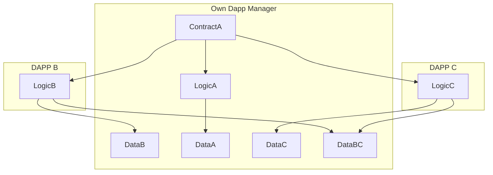
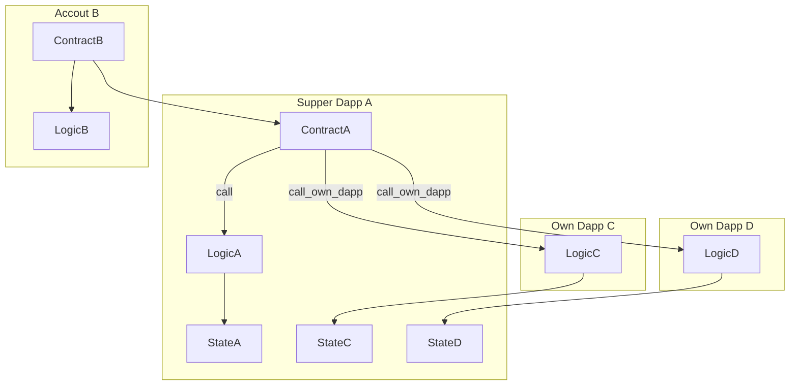

## Simple Summary
A standard interface for manage modular Own Dapp.

## Abstract
该SNRC是模块化的Own Dapp的系统，也可以称之为Supper Dapp,该Supper Dapp管理所有的Own Dapp,并且没有数量限制,这里Own Dapp是代码逻辑是单独declare的，Own Dapp之间可共享存储变量。


## Motivation

1. 提供单一智能合约地址支持多个Own Dapp的功能
2. 该提议可基于账户抽象SNIP，让每个用户真正拥有自己的Own Dapp(例如用户自己nft市场，token交易市场，遗产，资产管理等)
3. Own Dapp存储共享，逻辑也可以重复使用，提供更强的组合性
4. 提供开启，关闭一个或多个 Own Dapp功能
5. Own Dapp可逐步开发，让你的Supper Dapp可持续成长
6. Supper Dapp模块化管理Own Dapp，添加新的Own Dapp不需要升级智能合约
7. Own Dapp的逻辑可重复使用
8. 可以直接支持部分现在已声明的Dapp智能合约


不同own dapp 之间的存储



外部账户调用Supper Dapp的Own Dapp逻辑



## Specification

安全考虑
own dapp 不能使用构造函数，采用init形式
own dapp不一定需要部署，但一定需要声明
需要注意共用存储，也可能带来存储冲突的问题

### Interface


An interface is a set of function signatures with concrete type parameters, usually represented by a `trait`. These are meant to be implemented as `external` by contracts complying with such interface. For example:

```cairo
// StarkNet interface for managing own DApps.
// This trait defines a set of functions for interacting with DApps from the perspective of an own.
#[starknet::interface]
trait IOwnDappManage<TContractState> {

    // Set the status (active or inactive) of multiple DApps.
    // `self` is a reference to the contract's state.
    // `dapps` is an array of DApp class hashes identifying each DApp.
    // `status` is an array of boolean values representing the status (active/inactive) of each DApp.
    fn set_own_dapps(ref self: TContractState, dapps: Array<starknet::ClassHash>, status: Array<bool>);

    // Get the status (active or inactive) of a specific DApp.
    // `self` is a pointer to the contract's state.
    // `dapp` is the class hash of the DApp for which the status is being queried.
    // Returns a boolean indicating the DApp's status.
    fn get_own_dapp_state(self: @TContractState, dapp: starknet::ClassHash) -> bool;

    // Set the approval status for all DApps.
    // `self` is a reference to the contract's state.
    // `approved` is a boolean value indicating the approval status to be set for all DApps.
    fn set_approval_all_dapps(ref self: TContractState, approved: bool);

    // Get the approval status for all DApps.
    // `self` is a pointer to the contract's state.
    // Returns a boolean indicating the global approval status for all DApps.
    fn get_approval_all_dapps(self: @TContractState) -> bool;

    // Execute a function on a specific DApp.
    // `self` is a reference to the contract's state.
    // `dapp` is the class hash of the target DApp.
    // `selector` is a 252-bit field element representing the function to be called on the DApp.
    // `calldata` is an array of 252-bit field elements representing the arguments for the function call.
    // Returns a span of field elements, which is the return value from the DApp function call.
    fn execute_own_dapp(ref self: TContractState, dapp: starknet::ClassHash, selector: felt252, calldata: Array<felt252>) -> Span<felt252>;

    // Read data from a specific DApp without modifying its state.
    // `self` is a pointer to the contract's state.
    // `dapp` is the class hash of the target DApp.
    // `selector` is a 252-bit field element representing the function to be called on the DApp.
    // `calldata` is an array of 252-bit field elements representing the arguments for the function call.
    // Returns a span of field elements, which is the data read from the DApp.
    fn read_own_dapp(self: @TContractState, dapp: starknet::ClassHash, selector: felt252, calldata: Array<felt252>) -> Span<felt252>;
}
```

### Event
```cairo
 #[event]
    #[derive(Drop, starknet::Event)]
    enum Event {
        SetOwnDapp: SetOwnDapp,
        SetApprovalAllDapp: SetApprovalAllDapp
    }

#[derive(Drop, starknet::Event)]
struct SetOwnDappState {
    // dapp_manage field holds a ContractAddress, representing the address
    // of the contract that manages the own DApp.
    dapp_manage: ContractAddress,

    // dapp field holds a ClassHash, which could be an identifier for the DApp.
    dapp: ClassHash,

    // state is a boolean indicating a certain state of the DApp, possibly its active or inactive status.
    state: bool
}

#[derive(Drop, starknet::Event)]
struct SetApprovalAllDapp {
    // dapp_manage field, similar to SetOwnDappState, refers to the managing contract's address.
    dapp_manage: ContractAddress,

    // approved is a boolean indicating whether all DApps are approved or not,
    // possibly for some kind of batch processing or global setting within the DApp management system.
    approved: bool
}

```


## Implementation

Example implementations are available at

- [Moss implementation](https://github.com/)

## Security Considerations
own dapp 不能使用构造函数，采用init形式
own dapp不一定需要部署，但一定需要声明
需要注意共用存储，也可能带来存储冲突的问题
每次添加或删除一个或多个dapp时，添加所有dapp时也是，合约都需发出一个事件。所有源代码都可以验证。
这使得人员和软件能够监控合同的变更。如果添加了任何不良的dapp，那么它是可以被看到的，而且可添加的dapp是通过验证后的。


## Copyright

Copyright and related rights waived via [MIT](../LICENSE).
