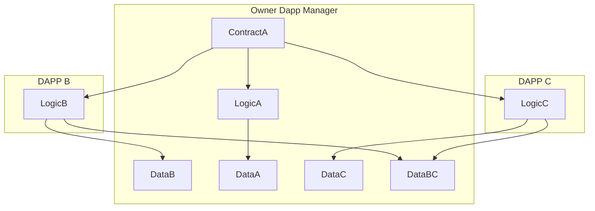
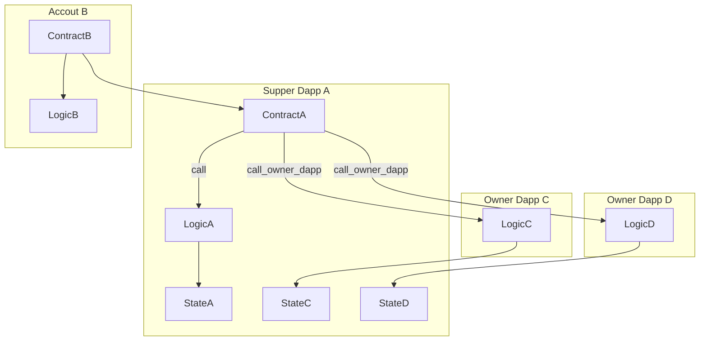

## Simple Summary
A standard interface for modular Owner Dapp.

## Abstract
该SNRC是模块化的Owner Dapp的系统，我们也可以称之为Supper Dapp,该Supper Dapp管理所有的Owner Dapp,并且没有数量限制,这里Owner Dapp是代码逻辑是单独declare的，Owner Dapp之间可共享存储变量。

## Motivation

1. 提供单一智能合约地址(也可以是用户的账户)支持多个Owner Dapp
2. 避免合约代码大小的限制
3. Owner Dapp存储共享，逻辑也可以重复使用，提供更强的组合性
4. 提供添加/替换/删除Onwer Dapp功能
5. 可逐步开发，让你的Supper Dapp可持续成长
6. Owner Dapp是模块化管理，添加新的需求可以不需要升级智能合约
7. Owner Dapp可重复使用
8. 可以直接支持部分现在已声明的Dapp(或者说智能合约)
9. 可提议可基于账户抽象SNIP，让每个用户拥有自己的Owner Dapp(例如nft市场，token交易市场，遗产，资产管理等)

存储脑图

外部合约调用Supper Dapp的Owner Dapp逻辑

## Specification
默认支持接口注册(外部判断，还需判断是否支持对应dapp)

批量添加/删除OwnerDapp功能（这里估计要与dapp注册抽离看，该提议可以与注册表无关）
添加，需要判断Dapp是否注册；
删除，需要判断是否已添加
添加所有dapp功能;

检查方面功能
读取OwnerDapp状态，{返回有可能为已添加，未存在，或者已删除}
是否添加所有；
读取所有Dapp;(// 现在痛点是Cairo没有查看合约所有dapp的数组功能，读取dapp功能前提需要dapp支持165)

操作功能（需要判断OwnerDapp是否添加和是否注册）
写OwnerDapp功能;
读OwnerDapp功能;

安全考虑
owner dapp 不能使用构造函数，采用init形式
owner dapp不一定需要部署，但一定需要声明
需要注意共用存储，也可能带来存储冲突的问题
每次添加或删除一个或多个dapp时，添加所有dapp时也是，合约都需发出一个事件。所有源代码都可以验证。
这使得人员和软件能够监控合同的变更。如果添加了任何不良的dapp，那么它是可以被看到的，而且可添加的dapp是通过验证后的。

## Implementation

## History

## Copyright

Copyright and related rights waived via [MIT](../LICENSE).
