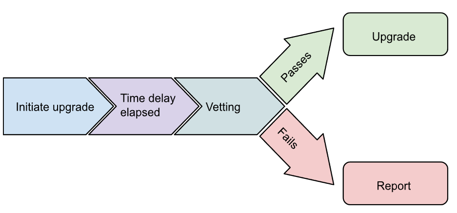
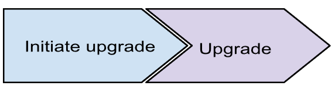
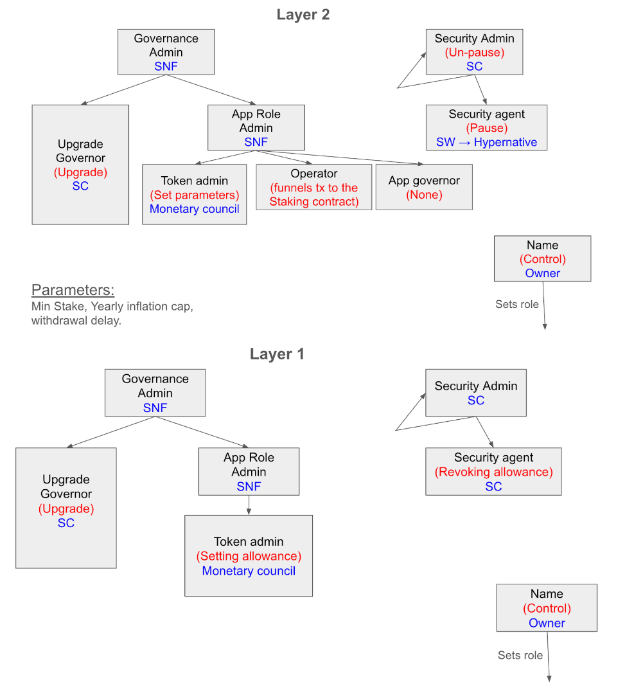
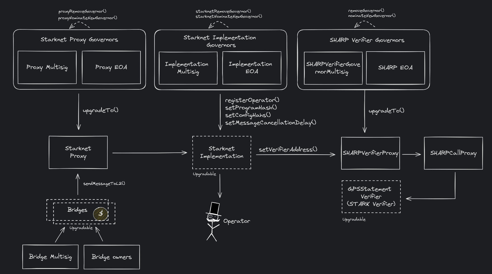

## Abstract

This Meta SNIP lays out the structure, motivation and decisions of the Starknet Security Council. It describes the process and rules that surround the Starknet Security Council.

## Motivation

The Starknet Security Council is made up of 12 members who are both geographically and organizationally diverse. They are tasked with safeguarding the security of Starknet. The Council assesses proposed upgrades to the network’s core contracts and approves them if no security risks are identified. In the event of an emergency, the Council has the authority to expedite necessary actions.

## Specification

The keywords “MUST”, “MUST NOT”, “REQUIRED”, “SHALL”, “SHALL NOT”, “SHOULD”, “SHOULD NOT”, “RECOMMENDED”, “MAY”, and “OPTIONAL” in this document are to be interpreted as described in RFC 2119.

### Composition

The council SHALL be composed of 12 security and blockchain experts and professionals, all of whom are committed to upholding Starknet's values and ensuring the platform's safety. They SHALL collectively be in possession of a multisig key that can take some actions detailed below.

### Duties and Responsibilities

- **Security Risk Assessment**: Evaluate upgrades to core contracts, ensuring no security risks.
- **Emergency Response**: Act quickly during emergencies to safeguard the Starknet protocol.
- **Approval Process**: Approve upgrades after thorough security vetting.
- **Transparency**: Provide detailed reports on any decisions, especially for rejected upgrades or emergency interventions.

The Security Council’s role is limited to ensuring the security of the network, and MUST NOT reject upgrades for any reason outside of security.

### Operational Upgrade Flow

Each upgrade flow will include two functions:

- **Add_new_implementation**: Declaring upgrade intent and context.
- **upgrade_to**: Apply upgrade

#### Flow 1: Vetted Time-Delayed (Regular)

This flow is not initiated by the Security Council and therefore MUST pass the maturity condition (i.e., security vetting and time delay).

- Someone suggests (`add_new_implementation`) an update to one of the security council-controlled contracts.
- The security council vets the upgrade and votes on it. If it passes (>50% of members voted to approve), they send a transaction with a multi-sig, marking the vetting as passed.
- The security council MUST put out a vetting report.
- There is a 7-day time delay that starts once the upgrade was suggested.
- If the time delay and the vetting have passed, the contract can be upgraded.
- If the time delay has passed and the upgrade hasn’t been vetted, it is considered rejected, and the affected contracts can’t be upgraded.

#### Flow 2: Non-Vetted, No Time Delay (Emergency Action)

This is an emergency flow, initiated by the security council; therefore, it is implicitly vetted as the issue was deemed by the security council to be time-sensitive, forgoing the time delay.

- The security council votes on the proposed emergency upgrade. It needs 75% of Security Council members to approve it.
- The Security Council suggests the upgrade as an emergency upgrade.
- No vetting is needed, no time delay is in effect, and the upgrade takes effect immediately.
- The security council will put out a report explaining why they took this action.

| Flow                      | Upgrade Initiator                           | Threshold | Time Delay |
| ------------------------- | ------------------------------------------- | --------- | ---------- |
| Vetted time delayed       | Someone (currently, only SW or the council) | 50%       | Regular    |
| Non-vetted, no time delay | Security council                            | 75%       | None       |

**Note**: Regular time delay SHOULD be set to at least 7 days to be in line with l2beat guidelines.

### Pausing Flow

Each pausing flow will include two functions:

- **Pause**: Stopping the affected smart contract from further changes of state.
- **Unpause**: Resuming normal operation.

#### Flow 1: Pausing the Contract

In case of critical incidents, a monitoring entity has the ability to pause the affected contracts immediately. This pause mechanism serves as a first line of defense to contain potential losses while the Security Council deliberates on a potential upgrade.

- The security council is responsible for adding/removing authorized address(es) that can pause the contract.

#### Flow 2: Unpausing the Contract

Once the security council decides that the smart contract can resume operation, it can unpause the contracts with a majority vote (50%).

### Vetting Failure Report

In the event that the evaluation of an upgrade does not receive the requisite number of votes (50% for a regular action and 75% for an emergency action), the Security Council SHALL produce a "Vetting Failure Report" within fourteen days of the vote on the upgrade, including:

- The rationale behind the negative votes cast by members.
- The rationale of the members who did approve the upgrade, if any.
- An enumeration of the issues identified with the upgrade.
- Potential avenues for resolving said issues, if feasible.

The Security Council's sole grounds for either rejecting or approving upgrades will be security concerns.

## Security Concerns

The security council shall be responsible for assessing the extent to which a security concern is present. Given the nature of such concerns, it is not possible to produce a comprehensive list, so the following list is non-exhaustive and provided for illustrative purposes only:

- **Smart Contract Vulnerabilities**: Bugs, exploits, and vulnerabilities that can lead to theft of funds, manipulation of the network, or other unintended consequences.
- **Attacks and Hacks**: Sybil, Denial of Service (DoS), Double-Spending, Phishing, Social Engineering.
- **Stability and Integrity Issues**
- **Liveness Issues**
- **Malicious or Rogue Nodes**
- **Oracle Manipulation**

### Security Emergency

The Security Council is permitted to preemptively address actual or anticipated bugs, defects, unplanned maintenance, stability issues, integrity, availability, non-repudiation, or other security issues with Starknet.

These Emergency response measures MAY be taken without specific Governance approval.

If the Security Council ever utilizes this discretion, it MUST provide the community with a prompt and comprehensive retrospective (within the bounds of any legal commitments to or security requirements for confidentiality) after the action is taken, explaining the rationale for it.

### Eligibility

Members MUST meet the following criteria:

- **Technical Competency**: Familiarity with Starknet and secure key management.
- **Reputation and Alignment**: Trustworthy individuals aligned with Starknet’s vision and values.
- **Diversity**: Geographic and organizational diversity to prevent overconcentration, with less than 50% from any one country, and fewer than four people from the same organization.
- **Screening**: All members must pass KYC/AML checks and sign a standard contract accepting their responsibilities within the role.

### Compensation

Council members receive a monthly stipend paid in STRK tokens for their contributions.

### Council Administrator

The administrator supports the council operation in an administrative capacity and does not have a vote. Responsibilities include:

- Alerting key holders of upcoming protocol upgrades.
- Managing required timelines.
- Scheduling, setting agendas, hosting Council meetings, and facilitating discussions.
- Monitoring compliance with procedures.
- Onboarding new Council participants.
- Communicating with external stakeholders.

### Duties and Obligations

#### Availability Commitment

The following communication channels should be responsive within a maximum delay of eight (8) hours:

- **Phone Call** - goes through silent mode (using Opus Genie).
- **Telegram**
- **Email**

**Note**: In an emergency response, Committee members should be capable of responding with a laptop and a hard ledger wallet during drills involving a realistic emergency scenario.

#### Scope of Work/Services

Assess and improve StarkGate’s monitoring and security system, including:

- Reviewing the monitoring service triggers for alerts.
- Ensuring that all essential assets are monitored.
- Analyzing StarkWare's monitoring in comparison with other services and chains.
- Proactively surveying the monitoring agent's dashboard and event detection to manually identify suspicious activities and suggest alert improvements.

#### Work Hours

The Committee member is required to be on call 24/7. If unavailable on any given day, they must notify the council administrator at least 24 hours in advance. **Days of non-availability are not limited.**

Finally, all Security Council participants are also responsible for complying with (i) the Code of Conduct of the Starknet governing body and (ii) any additional internal conflict of interest procedures that the Council may develop from time to time.

### Starknet Governing Body Code of Conduct

To foster a community of respect, inclusivity, and safety, all members of the Council are expected to adhere to the following principles:

- **Active Participation**: Members are expected to actively engage in discussions and decision-making processes.
- **Accessibility**: Members should remain accessible to the community through open discussions on the Starknet community forum.
- **Ethical Behavior**: Members should uphold the highest standards of ethics, integrity, professionalism, and accountability in all their interactions.
- **Positive Communication**: Members are encouraged to contribute to a positive and respectful culture of communication.
- **Respect and Non-Discrimination**: Members are expected to conduct themselves in a respectful manner that promotes diversity and inclusivity. Members must refrain from engaging in any form of disrespect, including but not limited to hate speech, racism, misogyny, gender-based hatred, ageism, religious discrimination, discrimination based on sexual orientation, ableism, or ad hominem attacks.
- **Non-Violence**: Members are expected to avoid promoting or endorsing physical or verbal violent behavior, or any actions that may cause harm.
- **No Abuse of Position**: Members must not exploit their position within the Council to promise retribution or undue advantages to others.

- **Conflict of Interests**: Members are required to declare and, when necessary, withdraw from participation in cases where a conflict of interest arises
- **Confidentiality**: Sensitive information obtained during discussions must remain confidential and must not be disclosed.

Adherence to these principles is essential to maintaining the integrity and effectiveness of the Security Council and fostering a harmonious and productive community.

### Adding and Removing Members

The Starknet Foundation is responsible for appointing and compensating Council membership from a purely administrative perspective. The Starknet Foundation will similarly have the ability to remove council members purely from an administrative perspective - but only to the extent that the criteria below has been met:
Criteria for removal of council members:

(i) failure to adhere to the code of conduct;
(ii) failure to undertake security council duties and responsibilities;
(iii) a conflict of interest arises;
(iv) a member is responsible for a security breach;
(v) the member no longer possesses the technical or strategic knowledge that is needed for future security challenges; and / or
(vi) there is a wider community loss of confidence in a council member.

### Security Council Phasing In

#### **Phase 1**

In phase 1, the Security Council will monitor upgrades affecting the Starknet staking core infrastructure, including:

**On Starknet**:

- Staking
- Operator
- Minting curve
- L2 rewards supply
- Delegation pool

**On Ethereum**:

- STRK mint manager
- L1 reward supplier

Additionally, the SC will act as the:

- **Security Admin on the L2 Staking contract**:
  - Setting the security agent (the entity that can pause the contracts)
  - Unpausing the contracts
- **Security Admin on L1 STRK mint manager**:
  - Setting the security agent (the entity that can revoke allowance)
- **Security Agent on L1**:
  - Revoking allowance in case of emergency
    See the following role diagram:
    

#### **Phase 2**

In phase 2, the Security Council will expand its duties to monitor upgrades affecting all of Starknet’s core infrastructure, including all contracts listed in Phase 1 and additional contracts affecting the overall state of Starknet.

## Rationale

**A Security Council is a committee of Ethereum L1 (possibly Starknet L2) multi-sig signers. It is empowered to perform certain actions on behalf of the network: Emergency Action and Non-Emergency Actions.**

Emergency Actions are the last line of defense against bugs and earthshattering events. Due to their unexpected nature they cannot be listed exaustively. Non-Emergency actions frame the normal flow of upgrade and lifetime of the network. They are scoped in a specific meta SNIP dedicated to a network upgrade.

The Starknet Security Council is elected with the help of the Starknet community, the Starknet Foundation, Starkware and the STRK token holders. The election process will be described in a specific post on the [Starknet comunity forum](https://community.starknet.io/), where the election SHALL be held.

To design this proposal, we relied on the following set of resources:

- [Stages update: Security Council requirements, Luca Donno](https://medium.com/l2beat/stages-update-security-council-requirements-4c79cea8ef52)
- [Introducing Stages — a framework to evaluate rollups maturity, Luca Donno](https://medium.com/l2beat/introducing-stages-a-framework-to-evaluate-rollups-maturity-d290bb22befe)
- [The Security Council, Arbitrum](https://docs.arbitrum.foundation/dao-constitution#section-3-the-security-council)
- [Security Council Charter v0.1](https://github.com/ethereum-optimism/OPerating-manual/blob/main/Security%20Council%20Charter%20v0.1.md)
- [Risk rosette framework](https://gov.l2beat.com/t/the-risk-rosette-framework/292)

## Security considerations

The key security consideration for the Starknet Security Council centers on implementation and technical risks. It is crucial to ensure that the smart contracts involved in the Council's operations, and the upgrade processes are secure and free from vulnerabilities. To mitigate these risks, all critical code MUST be audited and/or formally verified.

## Appendix

### Current upgradability structure

For reference, this is the current upgradability structure:

## Copyright

Copyright and related rights waived via [MIT](../LICENSE).
