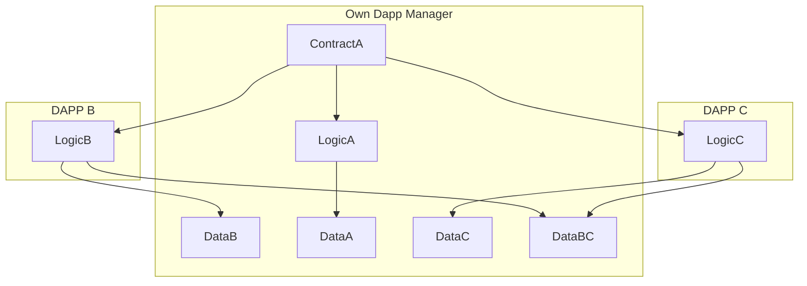
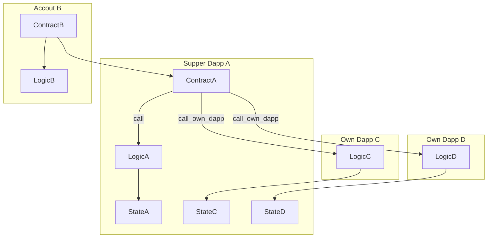

## Simple Summary
A standard interface for manage modular Own Dapp.

## Abstract
This SNRC is a system for manageing modular Own Dapps, also known as Supper Dapp. The Supper Dapp manages all Own Dapps without a limit on the number. Here, Own Dapp refers to a code logic that is declared. Own Dapps can share storage among themselves.


## Motivation

1. Provide a single smart contract address to support multiple Own Dapps.
2. This proposal can be based on the Standard Account Interface [SNIP-5](./snip-5.md), allowing each user to truly own their Own Dapp (e.g., Own NFT market, dex, inheritance, asset management, etc.).
3. Shared storage for Own Dapps and reusable logic, offering stronger composability.
4. Provide the ability to enable or disable one or more Own Dapps.
5. Own Dapps can be developed progressively, allowing your Supper Dapp to grow continuously.
6. Supper Dapp modularly manages Own Dapps, and adding new Own Dapps does not require upgrading the smart contract.
7. Direct support for some of the currently declared Dapp smart contracts.


### Storage among different Own Dapps



### External accounts call Supper Dapp’s Own Dapp logic



## Specification


### Interface


An interface is a set of function signatures with concrete type parameters, usually represented by a `trait`. These are meant to be implemented as `external` by contracts complying with such interface. For example:

```cairo
// StarkNet interface for managing own DApps.
// This trait defines a set of functions for interacting with DApps from the perspective of an own.
#[starknet::interface]
trait IOwnDappManage<TContractState> {

    // Set the status (active or inactive) of multiple DApps.
    // `self` is a reference to the contract's state.
    // `dapps` is an array of DApp class hashes identifying each DApp.
    // `status` is an array of boolean values representing the status (active/inactive) of each DApp.
    fn set_own_dapps(ref self: TContractState, dapps: Array<starknet::ClassHash>, status: Array<bool>);

    // Get the status (active or inactive) of a specific DApp.
    // `self` is a pointer to the contract's state.
    // `dapp` is the class hash of the DApp for which the status is being queried.
    // Returns a boolean indicating the DApp's status.
    fn get_own_dapp_state(self: @TContractState, dapp: starknet::ClassHash) -> bool;

    // Set the approval status for all DApps.
    // `self` is a reference to the contract's state.
    // `approved` is a boolean value indicating the approval status to be set for all DApps.
    fn set_approval_all_dapps(ref self: TContractState, approved: bool);

    // Get the approval status for all DApps.
    // `self` is a pointer to the contract's state.
    // Returns a boolean indicating the global approval status for all DApps.
    fn get_approval_all_dapps(self: @TContractState) -> bool;

    // Execute a function on a specific DApp.
    // `self` is a reference to the contract's state.
    // `dapp` is the class hash of the target DApp.
    // `selector` is a 252-bit field element representing the function to be called on the DApp.
    // `calldata` is an array of 252-bit field elements representing the arguments for the function call.
    // Returns a span of field elements, which is the return value from the DApp function call.
    fn execute_own_dapp(ref self: TContractState, dapp: starknet::ClassHash, selector: felt252, calldata: Array<felt252>) -> Span<felt252>;

    // Read data from a specific DApp without modifying its state.
    // `self` is a pointer to the contract's state.
    // `dapp` is the class hash of the target DApp.
    // `selector` is a 252-bit field element representing the function to be called on the DApp.
    // `calldata` is an array of 252-bit field elements representing the arguments for the function call.
    // Returns a span of field elements, which is the data read from the DApp.
    fn read_own_dapp(self: @TContractState, dapp: starknet::ClassHash, selector: felt252, calldata: Array<felt252>) -> Span<felt252>;
}
```

### Event
```cairo
 #[event]
    #[derive(Drop, starknet::Event)]
    enum Event {
        SetOwnDapp: SetOwnDapp,
        SetApprovalAllDapp: SetApprovalAllDapp
    }

#[derive(Drop, starknet::Event)]
struct SetOwnDappState {
    // dapp_manage field holds a ContractAddress, representing the address
    // of the contract that manages the own DApp.
    dapp_manage: ContractAddress,

    // dapp field holds a ClassHash, which could be an identifier for the DApp.
    dapp: ClassHash,

    // state is a boolean indicating a certain state of the DApp, possibly its active or inactive status.
    state: bool
}

#[derive(Drop, starknet::Event)]
struct SetApprovalAllDapp {
    // dapp_manage field, similar to SetOwnDappState, refers to the managing contract's address.
    dapp_manage: ContractAddress,

    // approved is a boolean indicating whether all DApps are approved or not,
    // possibly for some kind of batch processing or global setting within the DApp management system.
    approved: bool
}

```


## Implementation

Example implementations are available at

- [Moss implementation](https://github.com/mossdapp/superdapp)

## Security Considerations
1. An own dapp cannot use a constructor function and should adopt an init function
2. An own dapp does not necessarily need to be deployed but must be declared.
3. Shared storage should be carefully considered as it might lead to storage conflicts.
4. Whenever one or more own dapps are added or removed, and also when all dapps are added, the contract must emit an event.
5. All own dapp source code can be verified.


## Copyright

Copyright and related rights waived via [MIT](../LICENSE).
