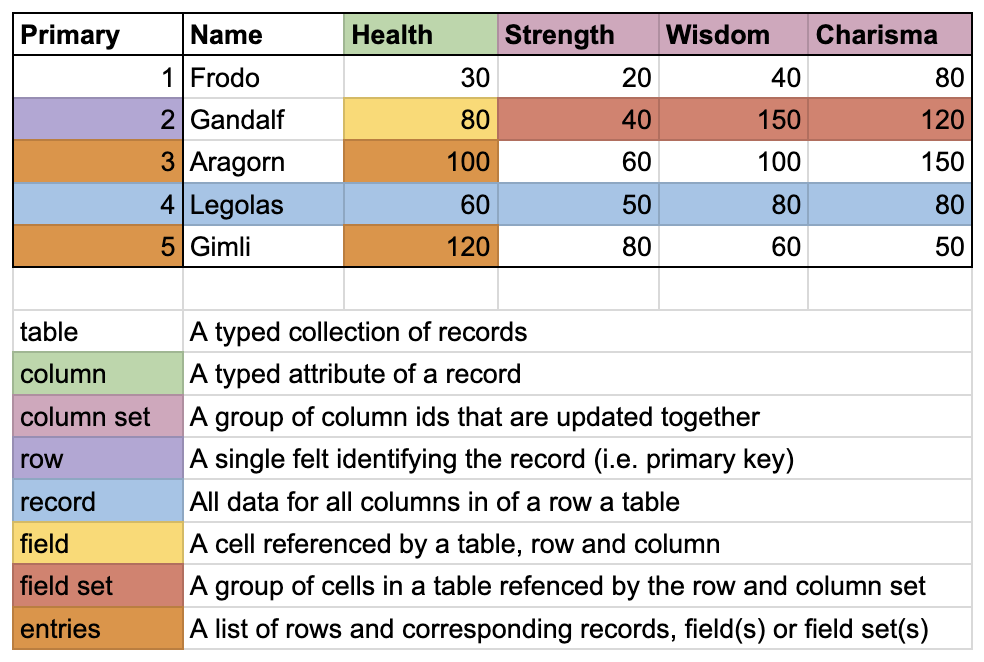
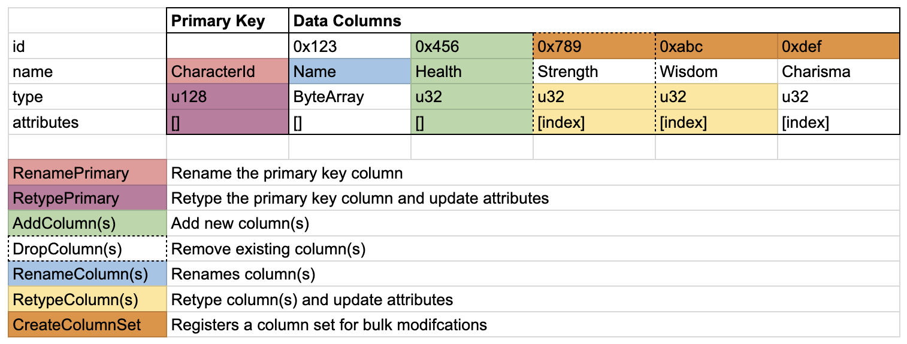

<!-- Refer to: <https://github.com/starknet-io/SNIPs/blob/main/SNIPS/snip-1.md> -->

# Abstract

This SNIP proposes a standardized collection of **types** and **events** for describing onchain data, as well as a compact **serialization** scheme for wire transmission, enabling the development of _generic indexers_ for _efficiently parsing_ data from _arbitrary contracts_.

# Motivation

One of the challenges of blockchain application development is making chain data accessible to clients. Many applications adopt the pattern of creating offchain replicas ("indexes") of onchain state, but without a shared standard most applications end up "rolling their own" non-interoperable tools for representing, fetching, storing, and serving onchain data. This leads to duplicated efforts and creates a high barrier to entry for new developers.

Standards such as ERC20 and ERC721 establish common interfaces for _certain_ onchain data structures, but we have yet to see a general standard for describing _arbitrary_ onchain data structures; a gap this SNIP is trying to fill.

A common source of type data for contracts is the ABI (application binary interface), which describes function inputs, outputs, and events declared by the contract. However, ABIs are not secure -- only the hash is verified, and when deployed could be set to anything. We would prefer a _self-documenting_ specification derived from events emitted by deployed contracts -- a type of "write-ahead logging" converting onchain state into offchain representations.

In 2023, the Dojo framework implemented a gaming-specific introspect scheme tightly coupled to its own indexer; this worked well for the use-case but struggled to generalize as the user base expanded. This SNIP proposes a _general_ standard for describing onchain state, splitting the solution into three parts: _types_, _events_, and _data serialization rules_.

The end goal is for Cairo developers to be able to integrate this functionality trivially, by way of an external framework, as in this example:

```rust
#[derive(Introspect, ISerde)]
struct Player {
    health: u32,
    strength: u32,
}
```

By adopting this SNIP, Cairo developers will be able to more easily make their onchain data available for offchain indexing, simplifying application development on Starknet.

# Specification

The standard consists of three parts: **types**, **events**, and **serialization**. The data model mimics those used by standard databases, oriented around "tables" and typed "columns," making it easy to mirror onchain data using any number of existing production-ready storage solutions.

The specification is designed to be **extendible**, supporting the addition of types and events not described in this spec. The minimum requirement is that indexers are able to parse data streams conforming to the specified wire format, and to be able to interpret the types and events described here.

The key words “MUST”, “MUST NOT”, “REQUIRED”, “SHALL”, “SHALL NOT”, “SHOULD”, “SHOULD NOT”, “RECOMMENDED”, “MAY”, and “OPTIONAL” in this document are to be interpreted as described in RFC 2119.

## Types

Introspect defines several core types used to communicate onchain state changes. These include enumerations of primitive types, structs used for generic metadata, complex core types, custom types used for application-specific data, and table definitions for defining storage schemas. Several of these types mirror standard Cairo types, but in a struct format enabling standard serialization.

The `TypeDef` enum describes all data types initially supported by Introspect. Each variant represents either a primitive type or a composite type with associated structure.

All indexers implementing Introspect MUST support the following types:

```rust
enum TypeDef {
  #[default]
  None,                              // Unit type () or empty enum

  // Field elements and bytes
  Felt252,                           // Base field element
  Bytes31,                           // 31 bytes packed into a felt252
  Bytes31E: ByteArray,               // 31 bytes with specified encoding

  // Strings
  ShortUtf8,                         // UTF-8 string up to 31 bytes
  ByteArray,                         // Variable-length byte array
  Utf8String,                        // Variable-length UTF-8 string
  ByteArrayE: ByteArray,             // Variable-length bytes with encoding

  // Boolean
  Bool,                              // True or false

  // Unsigned integers
  U8,                                // 8-bit unsigned integer
  U16,                               // 16-bit unsigned integer
  U32,                               // 32-bit unsigned integer
  U64,                               // 64-bit unsigned integer
  U128,                              // 128-bit unsigned integer
  U256,                              // 256-bit unsigned integer
  U512,                              // 512-bit unsigned integer

  // Signed integers
  I8,                                // 8-bit signed integer
  I16,                               // 16-bit signed integer
  I32,                               // 32-bit signed integer
  I64,                               // 64-bit signed integer
  I128,                              // 128-bit signed integer

  // Starknet types
  ClassHash,                         // Contract class identifier
  ContractAddress,                   // Contract address
  EthAddress,                        // Ethereum address (20 bytes)
  StorageAddress,                    // Storage slot address
  StorageBaseAddress,                // Storage base address

  // Collections
  Tuple: Span<TypeDef>,              // Fixed heterogeneous sequence
  Array: Box<TypeDef>,               // Variable-length homogeneous sequence
  FixedArray: Box<FixedArrayDef>,    // Fixed-length homogeneous sequence
  Felt252Dict: Box<TypeDef>,         // Mapping from felt252 to values

  // Composite types
  Struct: StructDef,                 // Named product type with fields
  Enum: EnumDef,                     // Tagged union with variants

  // Wrapper types
  Option: Box<TypeDef>,              // Optional value (Some or None)
  Result: Box<ResultDef>,            // Success or error (Ok or Err)
  Nullable: Box<TypeDef>,            // Nullable pointer

  // References
  Ref: felt252,                      // Reference to a declared type by hash
  Custom: ByteArray,                 // User-defined type by name
}
```

> [!IMPORTANT]
> `Box<T>` is used to wrap types that themselves contain a `TypeDef`, as the compiler can't handle recursive types.

### Key Types

A common database construct is the **primary key** which uniquely identifies a record. Any value used as a primary key MUST be representable using a single `Felt252`.

The `PrimaryTypeDef` is a subset of `TypeDef` containing valid primary key types:

```rust
enum PrimaryTypeDef {
    #[default]
    Felt252,
    ShortUtf8,
    Bytes31,
    Bytes31Encoded: ByteArray,
    Bool,
    U8,
    U16,
    U32,
    U64,
    U128,
    I8,
    I16,
    I32,
    I64,
    I128,
    ClassHash,
    ContractAddress,
    EthAddress,
    StorageAddress,
    StorageBaseAddress,
}
```

> Complex data types (like a `Struct` or `ByteArray`) may be hashed to produce a primary key.

### Attributes

An attribute is a key-value pair that can be attached to various items to provide additional metadata (e.g. marking columns for indexing).

```rust
struct Attribute {
    name: ByteArray,
    data: Option<ByteArray>,
}
```

### Complex Core Types

The following structs represent complex types with Cairo-specific purposes:

```rust
// Defines a typed, fixed-size array

struct FixedArrayDef {
    type_def: TypeDef,
    size: u32,
}

// Defines the structure of a result

struct ResultDef {
    ok: TypeDef,
    err: TypeDef,
}
```

### Complex Custom Types

The following structs represent application-specific data:

```rust
// Defines structs for arbitrary data

struct StructDef {
    name: ByteArray,
    attributes: Span<Attribute>,
    members: Span<MemberDef>,
}

struct MemberDef {
    name: ByteArray,
    attributes: Span<Attribute>,
    type_def: TypeDef,
}

// Defines enumeration types and variants

struct EnumDef {
    name: ByteArray,
    attributes: Span<Attribute>,
    variants: Span<VariantDef>,
}

struct VariantDef {
    selector: felt252,
    name: ByteArray,
    attributes: Span<Attribute>,
    type_def: Option<TypeDef>,
}
```

### Table Definitions

The following structs represent table column and data formats:

```rust
// Defines a column in a table

struct ColumnDef {
    id: felt252,
    name: ByteArray,
    attributes: Span<Attribute>,
    type_def: TypeDef,
}

// Defines a primary key in a table

struct PrimaryDef {
    name: ByteArray,
    attributes: Span<Attribute>,
    type_def: PrimaryTypeDef,
}

// Defines entry composed of a row and associated data

struct Entry {
    row: felt252,
    data: Span<felt252>,
}

// Defines an identifiable name

struct IdName {
    id: felt252,
    name: ByteArray,
}

// Defines an identifiable type definition

struct IdTypeDef {
    id: felt252,
    attributes: Span<Attribute>,
    type_def: TypeDef,
}
```

## Events

Events are a way for smart contracts to inform the outside world of any changes that occur during their execution, by writing additional data to the transaction's receipt. Event data are not readable by other contracts, but are accessible externally to indexers.

The following events comprise a _vocabulary_ for defining onchain state structures and changes, enabling offchain indexers to build accurate representations of onchain state.

It is RECOMMENDED that contracts implementing Introspect use Starknet events to emit these updates, although alternatives like direct data dumps are acceptable.

The following two graphics summarize the core database concepts which will be referenced repeatedly in the following event definitions.

#### Table Elements

The first graphic shows various terms describing _elements of a table_, highlighting the relationships between concepts like rows, records, columns, and fields:



#### Table Operations

The second graphic shows various terms describing _operations on a table_, highligting the relationships between names, types, and sets:



### Type Events

An event for declaring new types.

Contracts MUST emit this event before emitting events referencing this type.

```rust
// Declare a new type with a given name and structure

struct DeclareType {
    id: felt252,
    type_def: TypeDef,
}
```

### Database Events

Events for table, column and row manipulation.

> Events that apply to singular items have members expanded into the event for clarity.

Indexers implementing Introspection MUST support all _creation_ events (events beginning with `Create`, `Add`, `Insert`, or `Delete`), and MAY support all _mutating_ events (events beginning with `Rename`, `Retype`,  or `Drop`).
This is to enable immutable databases to implement this SNIP.

#### Definitions

The following terms are used to describe common database operations.

- `Create`: Used to make tables
- `Add`: Used to add columns to tables
- `Drop`: Used to remove tables and columns
- `Rename`/`Retype`: Used to change the name or type of table columns
- `Insert`: Used to add or update records and fields
- `Delete`: Used to remove records and fields

#### Table Management

Tables are one of the core concepts in Introspection's data model. Tables consist of **rows** of **records** with data in typed **columns**, corresponding closely to Cairo's notion of **structs** containing typed **members**.

**Common field meanings:**

- `id`: Unique table identifier

```rust
// Create or update a table with a given name, attributes and columns

struct CreateTable {
    id: felt252,
    name: ByteArray,
    attributes: Span<Attribute>,
    primary: PrimaryDef,
    columns: Span<ColumnDef>,
}

// Create or update a table from a class hash

struct CreateTableFromContract {
    id: felt252,
    name: ByteArray,
    contract_address: ContractAddress,
}

// Create or update a table from a class hash

struct CreateTableFromClass {
    id: felt252,
    name: ByteArray,
    class_hash: felt252,
}

// Rename an existing table

struct RenameTable {
    id: felt252,
    name: ByteArray,
}

// Drop an existing table

struct DropTable {
    id: felt252,
}
```

#### Column Management

Columns contain typed attributes of a record.

**Common field meanings:**

- `id`: Unique column identifier
- `table`: Matches `id` from [table events](#Table-Management)

```rust
// Add a new column to a table (note the expansion of `ColumnDef`)

struct AddColumn {
    table: felt252,
    id: felt252,
    name: ByteArray,
    type_def: TypeDef,
    attributes: Span<Attribute>,
}

// Add multiple new columns to a table

struct AddColumns {
    table: felt252,
    columns: Span<ColumnDef>,
}

// Rename an existing column in a table

struct RenameColumn {
    table: felt252,
    id: felt252,
    name: ByteArray,
}

// Rename multiple existing columns in a table

struct RenameColumns {
    table: felt252,
    columns: Span<IdName>,
}

// Change the type of an existing column in a table

struct RetypeColumn {
    table: felt252,
    id: felt252,
    type_def: TypeDef,
    attributes: Span<Attribute>,
}

// Change the types of multiple existing columns in a table

struct RetypeColumns {
    table: felt252,
    columns: Span<IdTypeDef>,
}

// Drop an existing column from a table

struct DropColumn {
    table: felt252,
    id: felt252,
}

// Drop multiple existing columns from a table

struct DropColumns {
    table: felt252,
    ids: Span<felt252>,
}
```

#### Primary Key Management

Primary keys are `Felt252`-compatible values uniquely identifying a record in a table.

**Common field meanings:**

- `table`: Matches `id` from [table events](#Table-Management)

```rust
// Rename the primary key of a table

struct RenamePrimary {
    table: felt252,
    name: ByteArray,
}

// Change the type of the primary key of a table

struct RetypePrimary {
    table: felt252,
    type_def: PrimaryTypeDef,
    attributes: Span<Attribute>,
}
```

#### Index Management

Indices are supplemental data structures enabling fast querying of specific columns.

**Common field meanings:**

- `id`: Unique index identifier
- `table`: Matches `id` from [table events](#Table-Management)
- `attributes`: Attributes associated with the index, eg a boolean flag for uniqueness
- `columns`: Ordered list of column IDs included in the index

```rust
// Create a new index on a table

struct CreateIndex {
    table: felt252,
    id: felt252,
    attributes: Span<Attribute>,
    columns: Span<felt252>,
}

// Drop an existing index from a table

struct DropIndex {
    table: felt252,
    id: felt252,
}
```

Indexes can also be made using attributes on columns and tables.
To create an index for a single column an empty attribute with the name `create_index` or `create_unique_index` can be used.

#### Column Set Management

A column set can be used to reference a set of fields and reduce the amount of data needed to reference them.

```rust
// Create a Column set with specified columns

struct CreateColumnSet {
    id: felt252,
    columns: Span<felt252>,
}
```

#### Record Manipulation

Stored in tables, **records** are the data of an application, identified by a unique primary key.

**Common field meanings:**

- `row`/`rows`: A felt for corresponding to the Primary key(s)
- `table`: Matches `id` from [table events](#Table-Management)
- `column`: Matches `id` from [column events](#Column-Management)
- `set`: Matches `id` from [column set events](#Column-Set-Management)
- `data`: Raw `felt252` values representing the data being inserted/updated
- `entries`: Collection of [`Entry`](#table-definitions) structs containing row and data pairs

```rust
// Insert or update a record in a table

struct InsertRecord {
    table: felt252,
    row: felt252,
    data: Span<felt252>,
}

// Insert or update multiple records in a table

struct InsertRecords {
    table: felt252,
    entries: Span<Entry>,
}

// Insert or update a field in a record

struct InsertField {
    table: felt252,
    row: felt252,
    column: felt252,
    data: Span<felt252>,
}

// Insert or update multiple fields in a record

struct InsertFields {
    table: felt252,
    row: felt252,
    columns: Span<felt252>,
    data: Span<felt252>,
}

// Insert or update a field in multiple records

struct InsertsField {
    table: felt252,
    column: felt252,
    entries: Span<Entry>,
}

// Insert or update multiple fields in multiple records

struct InsertsFields {
    table: felt252,
    columns: Span<felt252>,
    entries: Span<Entry>,
}

// Insert or update a set of fields in a record

struct InsertFieldSet {
    table: felt252,
    row: felt252,
    set: felt252,
    data: Span<felt252>,
}

// Insert or update multiple sets of fields in a record

struct InsertFieldSets {
    table: felt252,
    row: felt252,
    sets: Span<felt252>,
    data: Span<felt252>,
}

// Insert or update a set of fields in multiple records

struct InsertsFieldSet {
    table: felt252,
    set: felt252,
    entries: Span<Entry>,
}

// Insert or update multiple sets of fields in multiple records

struct InsertsFieldSets {
    table: felt252,
    sets: Span<felt252>,
    entries: Span<Entry>,
}

// Drop an existing row from a table

struct DeleteRecord {
    table: felt252,
    row: felt252,
}

// Drop multiple existing records from a table

struct DeleteRecords {
    table: felt252,
    rows: Span<felt252>,
}

// Drop an existing field from a record

struct DeleteField {
    table: felt252,
    row: felt252,
    column: felt252,
}

// Drop multiple existing fields from a record

struct DeleteFields {
    table: felt252,
    row: felt252,
    columns: Span<felt252>,
}

// Drop an existing field from multiple records

struct DeletesField {
    table: felt252,
    column: felt252,
    rows: Span<felt252>,
}

// Drop multiple existing fields from multiple records

struct DeletesFields {
    table: felt252,
    rows: Span<felt252>,
    columns: Span<felt252>,
}

// Drop a set of fields from a record

struct DeleteFieldSet {
    table: felt252,
    row: felt252,
    set: felt252,
}

// Drop multiple sets of fields from a record

struct DeleteFieldSets {
    table: felt252,
    row: felt252,
    sets: Span<felt252>,
}

// Drop a set of fields from multiple records

struct DeletesFieldSet {
    table: felt252,
    set: felt252,
    rows: Span<felt252>,
}

// Drop multiple sets of fields from multiple records

struct DeletesFieldSets {
    table: felt252,
    rows: Span<felt252>,
    sets: Span<felt252>,
}
```

### Variable Events

These events are for values that don't fit into the table/record model, such as global variables or configuration settings.

All indexers implementing value Introspection MUST support these events.

Common field meanings:

- `id`: Unique variable identifier

```rust
// Register a new variable

struct RegisterVariable {
    id: felt252,
    name: ByteArray,
    type_def: TypeDef,
}

// Register a new variable with value

struct DeclareVariable {
    id: felt252,
    name: ByteArray,
    type_def: TypeDef,
    data: Span<felt252>,
}

// Set the value of an existing variable

struct SetVariable {
    id: felt252,
    data: Span<felt252>,
}

// Rename an existing variable

struct RenameVariable {
    id: felt252,
    name: ByteArray,
}

// Delete an existing variable

struct DeleteVariable {
    id: felt252,
}
```

#### Example

Here is an example of how these types and events can be used to create offchain representations of onchain state:

**1. Define the schema (once):**

```rust
CreateTableWithColumns {
    id: 'Player',
    name: "Player",
    attributes: [],
    primary: PrimaryDef { name: "id", type_def: PrimaryTypeDef::Felt252, ... },
    columns: [
        ColumnDef { id: 'health', type_def: TypeDef::U32, ... },
        ColumnDef { id: 'strength', type_def: TypeDef::U32, ... },
    ]
}
```

**2. Insert data (often):**

```rust
InsertRecord {
    table: 'Player',   // Links to schema via table ID
    row: 0x123,        // Primary key
    data: [100, 10]    // Raw values: health=100, strength=10
}
```

The `data` field contains raw `felt252` values with no type information. Indexers use the table `id` to look up the previously-emitted schema and interpret the data accordingly.

## Serialization

### TypeDef Encoding

When a `TypeDef` is serialized, it MUST be prefixed with a **selector** - a Cairo short-string that identifies the variant. This allows a deserializer to determine which variant is being received and how to parse associated data.

The selector is encoded as a `felt252` containing the ASCII bytes of the selector string.
For example, `'struct'` is the ASCII bytes of "struct" interpreted as a `felt252`.

> TODO: explain why selector casing is inconsistent

#### Selector Table

Conforming implementations MUST use the following selectors:

| Variant              | Selector               | Associated Data                      |
| -------------------- | ---------------------- | ------------------------------------ |
| `None`               | `0`                    | —                                    |
| `Felt252`            | `'felt252'`            | —                                    |
| `Bytes31`            | `'bytes31'`            | —                                    |
| `Bytes31E`           | `'bytes31e'`           | encoding: `ByteArray`                |
| `ShortUtf8`          | `'ShortUtf8'`          | —                                    |
| `Bool`               | `'bool'`               | —                                    |
| `U8`                 | `'u8'`                 | —                                    |
| `U16`                | `'u16'`                | —                                    |
| `U32`                | `'u32'`                | —                                    |
| `U64`                | `'u64'`                | —                                    |
| `U128`               | `'u128'`               | —                                    |
| `U256`               | `'u256'`               | —                                    |
| `U512`               | `'u512'`               | —                                    |
| `I8`                 | `'i8'`                 | —                                    |
| `I16`                | `'i16'`                | —                                    |
| `I32`                | `'i32'`                | —                                    |
| `I64`                | `'i64'`                | —                                    |
| `I128`               | `'i128'`               | —                                    |
| `ClassHash`          | `'ClassHash'`          | —                                    |
| `ContractAddress`    | `'ContractAddress'`    | —                                    |
| `EthAddress`         | `'EthAddress'`         | —                                    |
| `StorageAddress`     | `'StorageAddress'`     | —                                    |
| `StorageBaseAddress` | `'StorageBaseAddress'` | —                                    |
| `ByteArray`          | `'ByteArray'`          | —                                    |
| `Utf8String`         | `'Utf8String'`         | —                                    |
| `ByteArrayE`         | `'ByteArrayE'`         | encoding: `ByteArray`                |
| `Tuple`              | `'Tuple'`              | elements: `Span<TypeDef>`            |
| `Array`              | `'Array'`              | element type: `TypeDef`              |
| `FixedArray`         | `'FixedArray'`         | element type: `TypeDef`, size: `u32` |
| `Felt252Dict`        | `'Felt252Dict'`        | value type: `TypeDef`                |
| `Struct`             | `'struct'`             | `StructDef`                          |
| `Enum`               | `'enum'`               | `EnumDef`                            |
| `Option`             | `'Option'`             | inner type: `TypeDef`                |
| `Result`             | `'Result'`             | `ResultDef`                          |
| `Nullable`           | `'Nullable'`           | inner type: `TypeDef`                |
| `Ref`                | `'ref'`                | type hash: `felt252`                 |
| `Custom`             | `'custom'`             | type name: `ByteArray`               |

> `None` uses `0` instead of a short-string, representing the absence of a type.

#### Example

Consider again the example of an onchain game's `Player` struct:

```rust
struct Player {
    health: u32,
    strength: u32,
}
```

This struct would be represented by the corresponding `TypeDef`:

```rust
TypeDef::Struct(StructDef {
  name: "Player",
  attributes: [],
  members: [
      MemberDef {
          name: "health",
          attributes: [],
          type_def: TypeDef::U32,
      },
      MemberDef {
          name: "strength",
          attributes: [],
          type_def: TypeDef::U32,
      },
  ],
})
```

The `TypeDef` serializes to a flat sequence of `felt252` values:

```
['struct', "Player", 0, 2, "health", 0, 'u32', "strength", 0, 'u32']
```

### ByteArray Encoding

A goal of this SNIP is gas-efficiency in event emissions. To reduce event size, a `ByteArray` MUST be serialized as follows:

- Implementations MUST NOT include a length prefix
- Bit 249 MUST indicate if it is the last `felt252` in the `ByteArray`
- Bit 248 MUST indicate if the felt is a partial word (less than 31 bytes)
- If the felt is a partial word, byte 30 MUST store the number of bytes

The result is that a `ByteArray` with 31 Bytes or less takes up a single `felt252`, with no felts used for total felts or pending word size.

#### Encoding Design

To understand how this scheme was developed, first consider Cairo's default `ByteArray` serialization. A `Serde`-encoded `ByteArray` takes up $3 + \lfloor B/31 \rfloor$ felts (`B` is the number of bytes being encoded), with the following structure:

| Component      | Encoding         | Felts                      |
| -------------- | ---------------- | -------------------------- |
| Full `byte31`  | `Span<byte31>`   | $1 + \lfloor B/31 \rfloor$ |
| Pending word   | `felt252`        | $1$                        |
| Pending length | `Bounded<0, 31>` | $1$                        |

In the standard scheme, **two felts** are used to encode the final word. Now, consider how Cairo uses a standard 256-bit word:

- `X`: Unusable Bit
- `*`: Partially useable bit in `felt252`
- `O`: Bit not used in `byte31` but used in `felt252`
- `±`: Bit used in both `byte31` and `felt252`

| Byte index (big-endian) | Bit Diagram<br/>`7 6 5 4 3 2 1 0` | Use in `byte31` | Use in `felt252` |
| ----------------------- | --------------------------------- | --------------- | ---------------- |
| 31 (MSB)                | `X X X X * O O O`                 | Unused          | Partial use      |
| 30                      | `± ± ± ± ± ± ± ±`                 | Usable          | Usable           |
| 29…1                    | `± ± ± ± ± ± ± ±`                 | Usable          | Usable           |
| 0 (LSB)                 | `± ± ± ± ± ± ± ±`                 | Usable          | Usable           |

The reason that bit 251 (bit 3 in the 31st byte) is _partially_ usable is due to the fact that a `felt252` can have a max value of $2^{251}+17*2^{192}$, which means that for values between $2^{251}$ and its max the `251` bit is `1`. In values above $17*2^{192}$ the `251` has to be `0` to avoid exceeding the max value.

This means there are three bits (`250`, `249`, `248`) are unused in byte31 but usable in felt252. **These can be used to encode a `ByteArray` in $1+\lfloor B/31 \rfloor$ felts.**

- `249`: `1` if it's the last felt in the ByteArray, `0` otherwise.
- `248`: `1` if it's an incomplete byte31 (≤30 bytes), `0` otherwise.
- If it's an incomplete `byte31` Byte 30 contains the number of bytes (0-30).

> [!IMPORTANT]
> The lack of a length prefix means deserializers MUST scan to the end for a terminator.

#### Examples

|     | 31B / 255-248b<br/>`7 6 5 4 3 2 1 0` | 30B / 247-240b<br/>`7 6 5 4 3 2 1 0` | 9-1B / 239-8b<br/>`7 6 5 4 3 2 1 0` | 0B / 7-0b<br/>`7 6 5 4 3 2 1 0` |
| --- | ------------------------------------ | ------------------------------------ | ----------------------------------- | ------------------------------- |
| 1   | `0 0 0 0 0 0 0 0`                    | `± ± ± ± ± ± ± ±`                    | `± ± ± ± ± ± ± ±`                   | `± ± ± ± ± ± ± ±`               |
| 2   | `0 0 0 0 0 0 1 0`                    | `± ± ± ± ± ± ± ±`                    | `± ± ± ± ± ± ± ±`                   | `± ± ± ± ± ± ± ±`               |
| 3   | `0 0 0 0 0 0 1 1`                    | `0 0 0 1 1 1 1 0`                    | `± ± ± ± ± ± ± ±`                   | `± ± ± ± ± ± ± ±`               |
| 4   | `0 0 0 0 0 0 1 1`                    | `0 0 0 0 0 0 0 1`                    | `0 0 0 0 0 0 0 0`                   | `± ± ± ± ± ± ± ±`               |
| 5   | `0 0 0 0 0 0 1 1`                    | `0 0 0 0 0 0 0 0`                    | `0 0 0 0 0 0 0 0`                   | `0 0 0 0 0 0 0 0`               |
| 6   | `0 0 0 0 0 0 0 1`                    | `0 0 0 1 1 1 1 0`                    | `± ± ± ± ± ± ± ±`                   | `± ± ± ± ± ± ± ±`               |

1. Full `bytes31` followed by more → $b^{249}=0$, $b^{248}=0$
2. Full `bytes31` not followed by more → $b^{249}=1$, $b^{248}=0$
3. 30 bytes not followed by more → $b^{249}=1$, $b^{248}=1$, $B_{30} = 30$ (number of bytes)
4. 1 byte not followed by more → $b^{249}=1$, $b^{248}=1$, $B_{30} = 1$
5. Empty `ByteArray` not followed by more data → $b^{249}=1$, $b^{248}=1$, $B_{30} = 0$
6. 30 bytes + more data (allowed but pointless) → $b^{249}=0$, $b^{248}=1$, $B_{30} = 30$

**Result:** up to 31 bytes encoded in 1 felt, vs. 3 with `Serde`.

An important implication of this scheme is that a `ByteArray` of less than 31 bytes would be identically sized to a `felt252` containing the same data -- meaning that `ByteArray` can be used as the default string type with no loss of efficiency.

### Attribute Encoding

[Attributes](#Attributes) MUST be encoded on top of the `ByteArray` optimization, using $b^{250}$ of the `name` member to indicate if the attribute's `data` option has a value:

- `0`: key-only attribute (`Option` is `None`)
- `1`: attribute has additional `data` (encoded `ByteArray` follows)

**Result:** 1 fewer felts per attribute.

### Event Struct Encoding

As with types, event structs use a custom serialization scheme to reduce the number of felts emitted. These optimizations leverage the fact that Starknet events arrive as a bounded `Span<felt252>` with a known length, allowing the final field to omit the length prefix.

Implementations MUST use the appropriate serialization strategy based on field position and type:

#### 1. Standard serialization

Used for non-final fields. Serializes using optimized `ByteArray`/`Attribute` encoding with a length prefix for collections.

#### 2. Terminal serialization

Used for the final field when it contains complex types (e.g., `Span<Attribute>`). Serializes using optimized `ByteArray`/`Attribute` encoding but omits the length prefix.

**Result:** between 1 and 3 fewer felts per event.

#### 3. No serialization

Used for the final field when it is `Span<felt252>`. Appends values directly with no serialization or length prefix.

**Result:** 1 fewer felts per event.

**Examples**

```rust
struct CreateTableWithColumns {
    id: felt252,
    name: ByteArray,                 // Standard serialization
    attributes: Span<Attribute>,     // Standard serialization
    primary: PrimaryDef,             // Standard serialization
    columns: Span<ColumnDef>,        // Terminal serialization
}

struct CreateFieldGroup {
    id: felt252,
    columns: Span<felt252>,          // No serialization (raw append)
}
```

> To best take advantage of these optimizations, members of a struct should be organized to place `Span` fields at the end.

# Reference Implementation

This SNIP specifies **types** and **events** for describing application data, as well as a **serialization** scheme for efficient transmission. It is expected that most developers will not implement this specification themselves, but rather leverage higher level frameworks and libraries on the contract, indexer and client side.

It is RECOMMENDED that libraries, frameworks, and tools support the entire spec, but in cases in which they do not, each library or framework SHOULD clearly document which events they use and how they interpret them.

Implementations MAY omit parts of the spec for optimization purposes, e.g. not allowing upgrades of database to allow for more efficient storage and querying.

## Traits

While this specification's _minimum_ requirement is emitting events with the correct structure, to make it easier to work with we recommend using traits for generating `TypeDef`s and serializing data. Our [reference implementation](https://github.com/cartridge-gg/introspect) provides these for all core Cairo and Starknet types, along with macros to generate them for custom structs and enums. Although this is still in pre release and may change, it serves as a useful example of how to implement the spec.

### `Introspect`

The `Introspect` trait is used to produce type definitions for external indexers, enabling correct data deserialization.

```rust
trait Introspect<T> {
    // Return the `TypeDef` for the type
    fn type_def() -> TypeDef;

    // Return a unique identifier for the type
    fn hash() -> felt252 {
        let mut serialized: Array<felt252> = Default::default();
        Serde::<TypeDef>::serialize(@Self::type_def(), ref serialized);
        poseidon_hash_span(serialized.span())
    }

    // Return a recursive, deduped array of (hash(), type_def()) for members
    fn child_defs() -> Array<(felt252, TypeDef)> {
        Default::default()
    }
}
```

Here is a sample implementation of `Introspect` for the `ComplexStruct` type:

```rust
use introspect::Introspect;
use introspect::type_definitions::{TypeDef, StructDef, MemberDef, merge_defs};
use crate::{SimpleStruct, SimpleEnum};


struct ComplexStruct {
    field1: SimpleStruct,
    field2: SimpleEnum,
    field3: bool,
}

impl ComplexStructIntrospectImpl of Introspect<ComplexStruct>{
    fn type_def() -> TypeDef {
        TypeDef::Struct(StructDef {
            name: "ComplexStruct",
            attributes: [].span(),
            members: Span<MemberDef>::from_array([
                MemberDef {
                    name: "field1",
                    attributes: [].span(),
                    type_def: Introspect::<SimpleStruct>::type_def(),
                },
                MemberDef {
                    name: "field2",
                    attributes: [].span(),
                    type_def: Introspect::<SimpleEnum>::type_def(),
                },
                MemberDef {
                    name: "field3",
                    attributes: [].span(),
                    type_def: Introspect::<bool>::type_def(),
                },
            ]),
        })
    }

    fn child_defs() -> Array<(felt252, TypeDef)> {
        merge_defs(array![
            Introspect::<SimpleStruct>::child_defs(),
            Introspect::<SimpleEnum>::child_defs(),
        ])
    }
}
```

The trait can also be implemented via a macro:

```rust
#[derive(Introspect, ISerde, Serde)]
struct ComplexStruct {
    field1: SimpleStruct,
    field2: SimpleEnum,
    field3: bool,
}
```

> [!IMPORTANT]
> To use the macro, all interior members must also implement `Introspect`.

### `ISerde` and `ISerdeEnd`

The `ISerde` trait (short for "Introspect Serde") is used to serialize data into a span of `felt252` values, which can then be deserialized by another system using the corresponding `TypeDef`. Its `iserialize` function mirrors `serialize` from `Serde`, but performs additional optimizations as [described earlier](#Serialization).

```rust
pub trait ISerde<T> {
    fn iserialize(self: @T, ref output: Array<felt252>);
    fn iserialize_inline(self: @T) -> Span<felt252> {
        let mut data: Array<felt252> = Default::default();
        Self::iserialize(self, ref data);
        data.span()
    }
    fn ideserialize(ref serialized: Span<felt252>) -> Option<T>;
}
```

For the final field in an event, the `ISerdeEnd` trait is used to omit the length prefix entirely, saving an additional `felt252`.

```rust
pub trait ISerdeEnd<T> {
    fn iserialize_end(self: @T, ref output: Array<felt252>);
    fn ideserialize_end(ref serialized: Span<felt252>) -> Option<T>;
}
```

### `Event`

The reference implementation reimplements Starknet's `Event` trait for each event struct, using `ISerde` instead of `Serde` for the data portion. This preserves the standard keys/data split while applying the gas-optimized serialization to the payload.

Here is an implementation of `Event` for the `CreateTable` struct:

```rust
impl CreateTableEvent of Event<CreateTable> {
    fn append_keys_and_data(
        self: @CreateTable,
        ref keys: Array<felt252>,
        ref data: Array<felt252>,
    ) {
        keys.append(*self.id);                     // Keys use standard append
        self.name.iserialize(ref data);            // Data uses ISerde
        self.primary.iserialize(ref data);
        self.attributes.iserialize_end(ref data);  // Final field omits length
    }

    fn deserialize(
        ref keys: Span<felt252>,
        ref data: Span<felt252>,
    ) -> Option<CreateTable> {
        CreateTable {
            id: *keys.pop_front()?,
            name: ISerde::ideserialize(ref data)?,
            primary: ISerde::ideserialize(ref data)?,
            attributes: ISerdeEnd::ideserialize_end(ref data)?,
        }
    }
}
```

> The full reference implementation is [available here](https://github.com/cartridge-gg/introspect).

# Backwards Compatibility

All data emitted with `ISerde` is expected to be decoded using the corresponding `TypeDef` by another system. Serialized data will appear as `Span<felt252>` in the ABI, which is well supported by existing infrastructure.

# Security Considerations

As this SNIP defines events and data structures for describing on-chain data, it does not introduce new security risks beyond those already present when dealing with untrusted contracts on permissionless blockchains. Implementers should ensure that the calls emitting these events are properly authorized to prevent unintended modifications to the offchain data structures.

## Copyright Waiver

Copyright and related rights waived via [MIT](https://opensource.org/license/mit).
